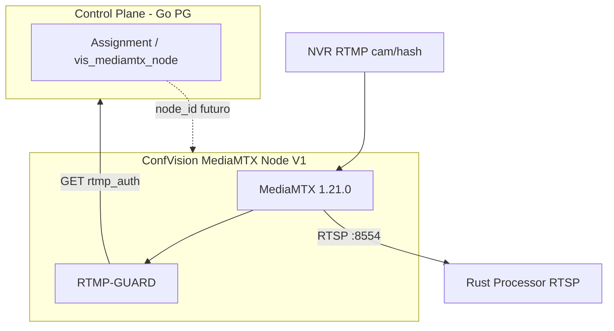

# ConfVision MediaMTX Node — V1 (Streaming Plane)

Documento canônico de arquitetura. Referências: `confvision-python/docs/ARQUITETURA_CONFVISION_ESCALA.md`, arquitetura alvo Control Plane / Rust (auditoria 2026).

**Escopo deste pacote:** ingest, roteamento, distribuição, recording nativo, API/metrics — **sem** assignment, lease, tenant ou Postgres.

---

## A. Arquitetura

```text
CONTROL PLANE (Go + PostgreSQL)     — fora deste pacote
        | assignment, config, vis_mediamtx_node
        v
MEDIA MTX FLEET (N nodes independentes)
        | RTMP :1935  RTSP :8554  HLS :8888  API :9997  metrics :9998
        | auth HTTP → RTMP-GUARD (127.0.0.1:8100) — código inalterado
        v
RUST PROCESSOR (Camera Processing Node) — RTSP pull cam/{hash}
        v
EVENT PIPELINE (Redis + vis_evento) — fora deste pacote
```

Topologia 10M+: **Regions → Clusters → Servers → MediaMTX Nodes → Streams** (muitos nodes, poucos streams cada).

---

## B. Estrutura de arquivos

```text
confvision-mediamtx-node/
  VERSION.json                 # MEDIAMTX_VERSION, CONFIG_VERSION
  ARCHITECTURE.md              # este documento
  README.md
  config/
    mediamtx.confvision.yml    # config produção baseline
    overlays/                  # dev, staging, prod, webrtc, srt
  deploy/
    Dockerfile.v1
    docker-compose.node.example.yml
    easypanel.env.example
  docs/
    DRAIN.md, ROLLING_UPDATE.md, TEST_PLAN.md, ROLLBACK.md
    MIGRATION_FROM_LEGACY.md, PROTOCOL_INVENTORY.md
  prometheus/
    mediamtx-scrape.example.yml
  scripts/
    validate-config.ps1, render-config.ps1
```

---

## C. Nova configuração

Arquivo: `config/mediamtx.confvision.yml`

| Bloco | Decisão V1 |
|-------|------------|
| GLOBAL | timeouts, log stdout+file em `/recordings` |
| AUTH | `http` → Guard |
| RTMP/RTSP | on, RTSP TCP (Rust estável) |
| HLS | on, **`hlsAlwaysRemux: false`** (on-demand) |
| WebRTC/SRT/MoQ | off baseline; overlays opcionais |
| RECORD | off em defaults; path `/recordings/...`; DVR liga via API |
| PATHS | regex `cam/[0-9a-z]{12,}` + `all_others` |

---

## D. Versão MediaMTX

| Variável | Valor |
|----------|--------|
| **MEDIAMTX_VERSION** | **1.21.0** (release oficial 2026-09-05, [mediamtx.org](https://mediamtx.org)) |
| **CONFIG_VERSION** | **confvision-mtx-v1.0.0** |
| Imagem Docker | `bluenviron/mediamtx:1.21.0` |

### Delta vs legado ConfVision (`mediamtx:1` floating)

- Pin explícito 1.21.0
- `metrics: yes` (:9998)
- `playback: yes` (:9996)
- `hlsAlwaysRemux: false` (legado: `yes`)
- `webrtc/srt/moq: false` (legado implícito on na imagem default upstream)
- Path regex documentado para `cam/{hash}`

Validar changelog 1.20→1.21 em deploy staging (YAML schema compatível com v1.21 sample).

---

## E. Compatibilidade RTMP-GUARD

- **Inalterado:** `authHTTPAddress: http://127.0.0.1:8100/auth`
- Guard recebe POST com `action`, `path`, `ip`, `user`, `password`, `protocol`, `id` (comportamento MediaMTX 1.21)
- Path: **`cam/{hash}`** — sem mudança
- API/metrics: Guard continua autorizando `action=api|metrics` com `MEDIAMTX_API_USER`

---

## F. Compatibilidade Rust

- RTSP: `rtsp://<host>:8554/cam/{hash}` (Hashids id câmera)
- **Nenhuma alteração** no processor
- MediaMTX permanece **fonte RTSP** após RTMP ingest; decode analítico só no Rust

---

## G. Metrics

- Endpoint nativo: **`:9998/metrics`** (Prometheus)
- Labels de scrape: `confvision_mediamtx_node_id`, cluster, region (externos ao MTX)
- Métricas MTX: paths, sessions, bytes, protocols — integração Grafana futura
- **Não** misturar com métricas Rust (`/health`) ou CP

Exemplo: `prometheus/mediamtx-scrape.example.yml`

---

## H. API

- **`:9997`** — v3 config paths (DVR `mediamtx_client.sync_record_paths`)
- Uso: list/patch/add paths **por câmera** (não listar milhões no YAML)
- Hot reload operacional via API global/paths quando suportado
- **Não** substitui APIs Go ConfVision

---

## I. Recording

- Default `record: false` em `pathDefaults`
- DVR worker liga `record: true` + `recordPath` via PATCH (formato fmp4, alinhado `dvr_main`)
- Evita segundo decode RTSP só para gravar — **record no MTX**
- Storage local `/recordings` + uploader Python (existente)

---

## J. Drain

- Procedimento: `docs/DRAIN.md`
- Estado **DRAINING** = Control Plane deixa de assignar novas câmeras ao node
- Streams ativos **não** são cortados pelo YAML
- Shutdown quando publishers = 0 (API list)

---

## K. Restart / Recovery

1. Container restart → Guard sobe → MediaMTX sobe
2. NVR reconecta RTMP (publishers dinâmicos)
3. CP re-registra node (`vis_mediamtx_node` futuro)
4. Rust sync assignment → RTSP reconnect

Falha auth CP: novos publishes dependem Guard cache; **sessões MTX locais** não consultam Postgres.

---

## L. Fleet readiness

- Um container = um **node** replicável
- Env identidade: `CONFVISION_MEDIAMTX_NODE_ID`, `CLUSTER_ID`, `REGION`, `NODE_STATUS`
- Sem config global com lista de câmeras
- Horizontal: N instâncias atrás de DNS/LB por região (RTMP pode ser anycast ou node-specific URL do CP)

Estados node (CP futuro): ONLINE, DEGRADED, FULL, OFFLINE, MAINTENANCE, DRAINING.

---

## M. Rolling update

Ver `docs/ROLLING_UPDATE.md` — 5% → 25% → 50% → 100%, rollback por tag.

---

## N. Security

- Secrets só env (`RTMP_PUBLISH_SECRET`, API pass, `VIS_WORKER_API_KEY` no Guard)
- API/metrics via auth HTTP Guard
- TLS terminação no reverse proxy (RTMPS/HLS HTTPS futuro)
- Não expor :9997/:9998 publicamente sem ACL

---

## O. Plano de testes

`docs/TEST_PLAN.md` — escala 1→1000 publishers/node, falhas, reconnect.

---

## P. Plano de rollback

`docs/ROLLBACK.md` — imagem `Dockerfile.mediamtx` + yaml legado.

---

## Diagrama geral (Mermaid)



---

## Comparação: atual × alvo V1

| Item | Legado foxpro | V1 Node |
|------|---------------|---------|
| Pacote | `confvision-python/mediamtx/` | `confvision-mediamtx-node/` |
| MTX version | `:1` float | **1.21.0** pin |
| CONFIG_VERSION | — | confvision-mtx-v1.0.0 |
| HLS | always remux | on-demand |
| Metrics | off | **:9998** |
| Fleet docs | — | DRAIN, rolling, tests |
| Guard/Rust/Go | baseline | **compatível** |

---

## Mudanças necessárias (fora deste pacote — backlog)

1. Control Plane: registrar `MEDIAMTX_VERSION` / `CONFIG_VERSION` em `vis_mediamtx_node`
2. D5 / drain flags no PG (não no MTX)
3. Prometheus/Grafana dashboards por node
4. Benchmarks reais → media capacity model
5. TLS ingress RTMP/HLS
6. Sunset `hlsAlwaysRemux: yes` em produção após validar players

**Implementado neste pacote:** config V1, Dockerfile.v1, docs operacionais, scripts validate/render — **sem** alterar Guard, Rust, Go, PG, Redis.
