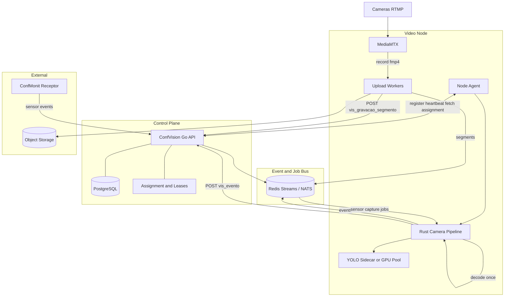

# ConfVision — arquitetura escalável (segunda etapa da auditoria)

Projeção arquitetural para crescimento **100 → 10M+ câmeras**, baseada no código em `core4/confvision/`, ConfVision Go e `confvision-rust-processor`.  
**Não implementa** código, serviços ou refatorações — apenas decisões de desenho justificadas.

Referência: [ARQUITETURA_MODULOS_CONFVISION.md](./ARQUITETURA_MODULOS_CONFVISION.md).

---

## 1. Estado atual

| Componente | Papel hoje | Acoplamento |
|------------|------------|-------------|
| ConfVision Go | API, Postgres, `vis_evento`, gravação metadata, auth worker | Control plane de fato, sem orquestrador de nós |
| MediaMTX (`confvision`) | Ingest RTMP, RTSP fan-out, record fMP4 (DVR) | 1 nó por site típico |
| confvision-worker (`main.py`) | RTSP + MOG2 gate + YOLO + fila Redis + POST evento | Data plane analítico Python |
| confvision-rust-processor | RTSP decode + motion gate + YOLO HTTP/ONNX + Redis + API | Data plane analítico Rust (piloto) |
| confvision-dvr | API MTX record + watcher FS + S3 + POST segmento | Orquestração leve, I/O pesado no MTX/disco |
| confvision-motion / timelapse | RTSP OpenCV + ffmpeg por câmera/thread | Duplica decode com worker/Rust |
| confvision-sensor | Poll API + capture RTSP | Desacoplado do pipeline de vídeo |
| confvision-sync-agent | Pull API → Redis cache config | Substituto parcial de control plane distribuído |

**Problema estrutural:** vários processos **independentes** abrem **RTSP separado** na mesma câmera; sharding é **estático** (`WORKER_SHARD_*`, `worker_id`, `MAX_CAMERAS` truncando listas); **ownership** de câmera não tem lease/fencing.

---

## 2. Problemas (síntese)

| Severidade | Problema |
|------------|----------|
| Crítico | RTSP fan-out (Rust + motion + timelapse + worker) — CPU/rede multiplicados |
| Crítico | Sem **camera assignment** com lease — risco de double-processing em failover |
| Crítico | Worker analítico e satélites **poll API** ou cache Redis **sem contrato de nó** |
| Importante | DVR: record local + watcher **single-host**; escala = disco + upload burst |
| Importante | Motion MOG2 **duplicado** vs motion gate Rust |
| Importante | Event bus: Redis **Lists** — sem ordering/partitioning forte para milhões de eventos |
| Importante | Postgres único para config + eventos + segmentos — hot rows em escala |
| Melhoria | sync-agent incompleto em alguns branches; integração dispatch Go stub |
| Melhoria | Monólito Python flat, sem testes nos workers satélite |

---

## 3. Princípios arquiteturais

1. **Um decode por câmera por nó** (pipeline coordenado), fan-out de **frames/metadata**, não de RTSP.
2. **Control plane centralizado** (Go + Postgres); **data plane horizontal** (Video Nodes).
3. **Ownership explícito:** câmera → shard → nó → processo, com lease renovável.
4. **Idempotência** em upload segmento e publicação evento (`camera_id + window + tipo`).
5. **Separação hot/cold path:** eventos recentes vs telemetria vs object storage.
6. **Python onde há ecossistema IA**; **Rust onde há RTSP/decode/latência**; **Go onde há API/orquestração**.
7. **Evolução incremental** — compatibilidade com `worker_id`, Redis keys e APIs atuais nas fases iniciais.

---

## 4. Control Plane

**Responsável por:** cadastro, tenants, câmeras, regras, `worker_id`/assignment futuro, metadados de gravação, eventos **como registro de negócio**, auth (`VIS_WORKER_API_KEY`), integrações, saúde agregada dos nós, políticas de retenção **como configuração**.

| Componente atual/futuro | Plano |
|-------------------------|--------|
| ConfVision Go + Postgres | **Control plane** principal |
| sync-agent (cache Redis) | **Transição** — absorvido por Node Agent + assignment API |
| vis_worker ping | **Telemetria** reportada ao control plane |
| Xano legacy | Substituído por Go (já em produção foxpro) |

**Não pertence ao control plane:** decode H.264, MOG2, ffmpeg encode longo, inferência YOLO em batch (exceto registro de modelos/versões).

---

## 5. Data Plane

**Responsável por:** ingest RTMP, RTSP interno, decode, motion/recording/analytics, captura snapshot/clipe, produção de bytes para object storage, publicação de **eventos técnicos** na bus.

| Componente | Plano |
|------------|--------|
| MediaMTX | **Ingest + record nativo** por nó (edge) |
| rust-processor | **Pipeline por câmera** (decode, gates, scheduler inferência) |
| motion/timelapse (atual) | **Consolidar** em módulos do pipeline ou jobs derivados de frames |
| confvision-worker | **Migrar** analítico para Rust + sidecar; Python legacy em declínio |
| DVR watcher/upload | **Agente no nó** colocalizado com MTX record dir |
| sensor capture | **Job assíncrono** disparado por event bus (não poll tight loop) |

---

## 6. Video Node

Unidade de escala horizontal: **1 (ou mais) MediaMTX + 1 Node Agent + 1+ Rust pipeline pools + uploaders + optional GPU YOLO**.

Premissas de dimensionamento (ordem de grandeza, VPS típica):

- **Analítico Rust + YOLO CPU:** ~5–15 câmeras/núcleo efetivo (depende stride, 1080p, admission).
- **Só ingest + DVR record:** dezenas–centenas de publicadores RTMP no mesmo MTX limitado por **bitrate agregado** e disco.
- **Motion/timelapse OpenCV atual:** ~2–8 câmeras/núcleo se 1 thread/câmera full RTSP.

O Video Node **registra-se** no control plane, recebe **lista de câmeras owned**, baixa config, inicia pipelines.

---

## 7. Análise por worker (8 perguntas)

Legenda: **M** manter como processo, **E** evoluir/incorporar, **S** substituir faseado, **L** biblioteca, **D** duplicação relevante.

### confvision-dvr

| # | Resposta | Justificativa |
|---|----------|---------------|
| 1 Continuar? | **Sim (E → Node DVR Agent)** | MTX record + upload é padrão válido; lógica em `mediamtx_client`, `dvr_watcher`, `dvr_segment` é I/O bound |
| 2 Go? | **Parcial** — uploader/scheduler metadados em Go; record continua MTX | Go bom para retry/idempotência/jobs; não precisa reescrever PATCH MTX |
| 3 Rust? | **Não prioritário** | Pouco CPU; benefício marginal |
| 4 Python? | **Transição** | Manter até Fase 6; depois Go agent ou sidecar leve |
| 5 Biblioteca? | **Sim** — `segment_upload`, idempotency key | Compartilhado motion/timelapse |
| 6 Worker especializado? | **Sim** — **Recording Uploader** por nó | Colocalizado com `DVR_RECORD_DIR` |
| 7 Incorporar? | **Node Agent + MTX hook** | sync record paths vira reconciler do assignment |
| 8 Duplicação? | **Baixa** vs analítico; **não** abre RTSP para decode |

### confvision-motion

| # | Resposta | Justificativa |
|---|----------|---------------|
| 1 Continuar? | **S (capacidade)** | MOG2 + RTSP + ffmpeg **duplica** Rust gate + gravação |
| 2 Go? | **Não** para CV | |
| 3 Rust? | **Sim — motion recording module** | Reutiliza decode; MOG2 ou gate já existente; ffmpeg clip sob demanda |
| 4 Python? | **Legacy até migração** | |
| 5 Biblioteca? | Políticas clip (pre/post roll) | |
| 6 Especializado? | **Feature flag** no pipeline, não app separado | |
| 7 Incorporar? | **Rust pipeline + optional encode job** | |
| 8 Duplicação? | **Alta** — RTSP + MOG2 vs Rust |

### confvision-timelapse

| # | Resposta | Justificativa |
|---|----------|---------------|
| 1 Continuar? | **S como modo**, não app | `timelapse_worker.py` compartilha 90% com motion |
| 2–4 | **Rust pipeline mode** + ffmpeg assemble | Frames from shared decode |
| 5 Biblioteca? | **Sim** — segment assembler | |
| 6 Especializado? | **Scheduler job** por câmera | |
| 7 Incorporar? | **Mesmo node pipeline** | |
| 8 Duplicação? | **Alta** vs motion + Rust |

### confvision-sensor

| # | Resposta | Justificativa |
|---|----------|---------------|
| 1 Continuar? | **Sim (forma diferente)** | Lógica `processar_evento_sensor` válida |
| 2 Go? | **Consumer event bus** + dispatch capture job | Poll API não escala |
| 3 Rust? | **Capture executor** (RTSP snapshot/clip já no Rust capture path) | |
| 4 Python? | **Opcional** para integrações rápidas | |
| 5 Biblioteca? | `event_capture` compartilhado | |
| 6 Especializado? | **Capture worker pool** no nó | |
| 7 Incorporar? | **Event-driven** no control plane | |
| 8 Duplicação? | RTSP só no momento capture — aceitável se não analítico contínuo |

### confvision-sync-agent

| # | Resposta | Justificativa |
|---|----------|---------------|
| 1 Continuar? | **S por Node Agent + CP assignment** | Redis cache global não define ownership |
| 2 Go? | **Sim** — sync/assignment no control plane | |
| 3 Rust? | Não | |
| 4 Python? | Deprecar | |
| 5–7 | **Node Agent (Go leve ou Rust)** registra nó, pull **assigned cameras** | |
| 8 Duplicação? | N workers polling mesma API |

### confvision-worker (`main.py`)

| # | Resposta | Justificativa |
|---|----------|---------------|
| 1 Continuar? | **Transição longa** | Produção atual |
| 2 Go? | Não para YOLO/RTSP | |
| 3 Rust? | **Sim — analítico principal** | Já piloto |
| 4 Python? | **Legacy + GPU farm distributed** (`YOLO_ARCH=distributed`) | GEX44 |
| 5 Biblioteca? | detector, scheduler_queue | |
| 6 Especializado? | **Rust node + YOLO sidecar/GPU pool** | |
| 7 Incorporar? | rust-processor + sidecar | |
| 8 Duplicação? | **Máxima** com Rust se ambos ativos na mesma câmera |

### confvision-rust-processor

| # | Resposta | Justificativa |
|---|----------|---------------|
| 1 Continuar? | **Sim — núcleo do data plane** | |
| 2 Go? | Não | |
| 3 Rust? | **Sim** | |
| 4 Python? | Sidecar YOLO HTTP permanece possível | |
| 5 Biblioteca? | crates internas (decode, motion, events) | |
| 6 Especializado? | **Camera Processing Node** | |
| 7 Incorporar? | Não fragmentar em 5 apps EasyPanel analíticos | |
| 8 Duplicação? | Com Python worker/motion se mal assignado |

---

## 8. Rust Processor — papel definido

### Deve ser (evolução **Camera Processing Node**)

| Função | Já existe (código) | Evoluir |
|--------|-------------------|---------|
| RTSP client + reconnect | Sim | Multi-tenant, lease-aware |
| Frame pipeline / decode | ffmpeg/retort | **Decoder único** export frames |
| Motion gate | pixel/scene, strides | Unificar com políticas gravação |
| Detector scheduler | YOLO async, inflight | Batch GPU remoto |
| Event producer | Redis + POST vis_evento | Idempotency key |
| Health / capacity | `/health`, admission | Node registration |
| Stream health / ping | vis_worker_ping, stream_ok | Control plane input |

### NÃO deve entrar (permanece outro componente)

| Função | Onde |
|--------|------|
| Gravação contínua fMP4 massiva | **MediaMTX record** + uploader |
| API REST tenants/usuários | **Go** |
| Assignment global / leases | **Go control plane** |
| Object storage long-term policy | **Go + lifecycle S3** |
| Integração Moni/webhooks completos | **Go** (dispatch) |
| Timelapse concat longo offline | **Job worker** (ffmpeg) separado do hot path |
| Banco Postgres direto | **Evitar** — manter API |

---

## 9. Python — papel futuro

| Manter Python | Motivo |
|---------------|--------|
| YOLO Ultralytics / experimentação | Ecossistema, notebooks, modelos novos |
| GPU cluster **distributed** (`gpu_scheduler`, `yolo_gpu_worker`) | Batch CUDA quando Rust delega HTTP |
| Scripts ops / migração | |
| Prototipagem CV | |

| Reduzir Python | Motivo |
|----------------|--------|
| sync-agent, poll loops | Go control plane |
| motion/timelapse RTSP threads | Rust pipeline |
| Infra sharding manual | Assignment service |

**Regra:** Python **não** deve ser o único dono de “quantas câmeras este host processa” — isso é control plane + lease.

---

## 10. Go — papel futuro

| Domínio | Go |
|---------|-----|
| API ConfVision | **Já** |
| Camera assignment, leases, node registry | **Novo** (evolução vis_worker + D5) |
| Scheduler jobs (sensor capture, upload retry, timelapse batch) | Workers idempotentes |
| Sync config **push** ou **pull por nó** | Substitui sync-agent Redis broadcast |
| Integrações, terminal, webhooks | |
| Observabilidade agregada | |
| Admin / tenant | |

Go **não** precisa decodificar H.264 em escala — delegar ao Video Node Rust.

---

## 11. MediaMTX

- **Por Video Node** (ou par MTX+node): ingest RTMP da região/site.
- **Record** para DVR contínuo — evita segundo RTSP decode para gravação 24/7.
- **RTSP interno** apenas para consumidores **legacy** durante migração; alvo = **1 consumidor** (Rust pipeline) + MTX record sidecar.
- Multi-node: **`vis_mediamtx_node_id`** já existe — alinhar assignment.

---

## 12. DVR — arquitetura futura

### Modelo atual (adequado até ~centenas de câmeras/nó com disco)

```text
RTMP → MediaMTX record → filesystem → watcher → S3 → POST vis_gravacao_segmento
```

### Limites

- Disco local **SPOF**; watcher **não distribuído**.
- Upload **síncrono por thread**; burst após outage.
- Retenção **não** no worker — depende API/S3 lifecycle.

### Proposta

```text
RTMP → MTX record (nó local, path por câmera)
     → Segment closed event (hook / notifier / fs notify)
     → Upload queue (Redis Stream ou NATS JetStream) job id = hash(camera, inicio, path)
     → Uploader worker (Go) com retry exponential
     → S3 / object storage
     → POST metadados idempotente
     → Lifecycle policy (tiering Glacier)
```

- **Múltiplos nós:** cada nó só watch **seu** `DVR_RECORD_DIR`; segmento referencia **`mediamtx_node_id`**.
- **Perda:** reprocessar `.fmp4` estáveis; dead letter queue; alerta se upload atrasado > N× segmento.

---

## 13. Motion — arquitetura futura

**Não manter:** RTSP + MOG2 Python **paralelo** ao Rust.

**Manter capacidade:** gravação por movimento (clipes).

```text
Decoder único (Rust)
  → motion gate (Rust, já existe)
  → se modo_gravacao=movimento e gate active:
        enqueue clip job (start/stop, post-roll)
  → ffmpeg encode (subprocess ou Rust wrapper) **só durante clip**
  → mesmo pipeline dvr_segment → S3
```

OpenCV MOG2 **opcional** só se Rust gate insuficiente para gravação (validar métricas); preferir **unificar algoritmo** para analítico e gravação.

GPU: **não** para MOG2 clássico; GPU para **YOLO** via sidecar/batch.

---

## 14. Timelapse

- **Não** worker EasyPanel separado em escala.
- **Modo** no pipeline: acumular frames **derivados do decode** (JPEG every N sec) ou snapshots baixa res.
- **Assemble** ffmpeg como **job batch** (baixa prioridade).
- Compartilha: decoder, storage temp, uploader, scheduler com motion/DVR metadata.

---

## 15. Sensor

### Atual

```text
Poll API pendentes → RTSP capture → finalizar evento
```

### Futuro

```text
ConfMonit/receptor → POST vis_evento (sensor) [Control Plane]
                 → Event Bus: topic sensor.capture {evento_id, camera_id}
Video Node (owner da câmera) → consumer → capture RTSP → upload → finalizar
```

Benefícios: escala poll no CP; capture no **nó que já tem stream**; menos RTSP órfão.

---

## 16. Sync Agent — evolução

### Atual

```text
API (todas câmeras filtradas) → Redis cache → N workers leem
```

Problemas: sem **ownership**; workers truncam `MAX_CAMERAS`; stale cache.

### Alvo

```text
Control Plane
  → Node Registry (heartbeat, capacity, mtx_node_id, labels)
  → Camera Assignment (camera_id → node_id, processor_id, epoch)
Video Node Agent
  → Register + heartbeat
  → Fetch **only assigned cameras** (ETag / config_version)
  → Reconcile local pipelines (start/stop)
```

Redis pode cachear **assignment snapshot por nó**, não lista global analítica para todos.

**Descoberta no nó:** `GET /vis_node/{node_id}/cameras` ou long poll / SSE (fase posterior).

---

## 17. Camera Assignment

### Modelo proposto

| Campo | Uso |
|-------|-----|
| `camera_id` | Chave |
| `assigned_node_id` | Video Node |
| `processor_id` / `worker_id` | Rust ou legacy Python |
| `lease_epoch` | Incrementa a cada reassignment |
| `lease_expires_at` | Renovável pelo processor heartbeat |
| `desired_state` | running / paused / drain |

### Mecanismos

- **Heartbeat:** processor ping (`vis_worker_ping`) estende lease se `cameras_ativas` bate assignment.
- **Lease:** Postgres row ou Redis key `lease:camera:{id}` com TTL + epoch.
- **Fencing:** todo evento/segmento carrega `lease_epoch`; control plane rejeita stale.
- **Failover:** lease expira → reassignment → novo nó **só inicia** após epoch bump.
- **Split-brain:** evitar dois Rust com mesmo `PROCESSOR_ID`; usar **unique node_id** + fencing.

Sharding atual (`camera_id % shard_total`) evolui para **consistent hashing** sobre nodes saudáveis.

---

## 18. Event Bus

### Uso atual

| Key | Padrão | Perfil |
|-----|--------|--------|
| `confvision:eventos` | Redis List | Eventos analíticos, consumer worker |
| `confvision:yolo:queue` | Redis sorted/list | Jobs YOLO distributed |
| `confvision:sync:*` | Redis string TTL | Config cache |

### Comparativo (perfil ConfVision: muitos produtores por nó, consumo at-least-once, volume médio-alto eventos, jobs upload/capture)

| Tecnologia | Eventos analíticos | Jobs (upload/capture/ffmpeg) | Comandos nó | Telemetria |
|------------|-------------------|------------------------------|-------------|------------|
| Redis List | OK **fase inicial** | Fraco (no ACK pattern) | OK | OK métricas leves |
| Redis Streams | **Bom** — consumer groups, ACK | **Bom** | Razoável | Bom |
| NATS JetStream | Bom, baixa latência | **Muito bom** | **Muito bom** | Excelente |
| Kafka | Overkill <10k câmeras; **bom** 100k+ eventos/s agregados | Bom | Pesado | Excelente |
| RabbitMQ | OK | OK | OK | OK |
| Postgres NOTIFY | Não escala ingest | Não | Não | Não |

**Recomendação evolutiva:**

- **Fase 5:** Redis Streams **ou** NATS (se multi-region futuro) substituem Lists para `eventos` e jobs upload.
- **Kafka:** considerar só se **>100k câmeras analíticas** com replay analytics obrigatório.
- **Telemetria/metrics:** Prometheus + OTel; **não** Postgres.

---

## 19. PostgreSQL

**Continua banco principal** para **configuração, ownership, eventos de negócio, metadados gravação, integração**.

| Dado | Store | Notas |
|------|-------|-------|
| Configuração | Postgres | tenants, cameras, rules |
| Eventos (`vis_evento`) | Postgres + **particionamento** por tempo/franqueado | Índices pesados em escala |
| Telemetria ping/worker | Postgres **curto prazo** → TSDB | vis_worker hoje; migrar métricas |
| Gravações (metadados) | Postgres | ponteiros S3 |
| Frames | **Nunca** Postgres | object storage / ephemeral SHM |
| Logs | Object storage / Loki | |
| Métricas | Prometheus/Mimir | |

**TimescaleDB:** útil para séries (fps, drop rate) por câmera.  
**ClickHouse:** analytics BI eventos em **100k+** câmeras, réplica async de eventos.  
**Redis:** cache assignment, rate limits, streams — **não** source of truth eventos.

---

## 20. Redis

- Cache assignment por nó
- Streams eventos/jobs (futuro)
- YOLO queue distributed (GPU)
- DLQ
- **Não** substituir Postgres para eventos duráveis críticos sem persistência configurada (JetStream/Kafka se necessário)

---

## 21. Object Storage

- Snapshots/clips evento
- Segmentos DVR/motion/timelapse
- Chaves por franqueado (`storage.py` / `gravacao_storage.py`)
- Lifecycle tiers para retenção legal
- **Frames timelapse temp:** disco nó ou SHM, não S3 por frame

---

## 22. Failover

1. Node heartbeat missing → mark node **draining**.
2. Leases cameras expiram → reassignment algorithm (capacity-aware).
3. New epoch → Rust stop old cameras, start new.
4. Upload jobs idempotent — safe retry após failover.
5. MediaMTX: RTMP publishers reconnect; paths stable via hash.

---

## 23. Observabilidade

| Fase | Entrega |
|------|---------|
| 2 | Métricas Rust (`/metrics`), logs estruturados workers, dashboards CPU/RTSP drops |
| 4+ | Trace por `camera_id` através decode→YOLO→evento |
| 6 | Node-level SLI: cameras_owned, lease_valid, upload_lag |

---

## 24. Escalabilidade — estimativas

Premissas base:

- **P** = fração câmeras com analítico humano ativo (~30% em VMS típico — ajustável).
- **Analítico:** ~10 câmeras/núcleo Rust+YOLO CPU com strides atuais; ~30–50 com GPU sidecar bem dimensionado.
- **Só DVR record:** ~50–200 streams/nó MTX limitado por **1–2 Gbps** ingest + SSD.
- **Motion legacy:** ~5 câmeras/núcleo se RTSP full — **eliminar** no alvo.

| Câmeras totais | Video Nodes (ordem) | Câmeras analíticas/node | Gargalo principal |
|----------------|---------------------|-------------------------|-------------------|
| **100** | 1–3 | 10–30 | Operacional, não arquitetura |
| **1 000** | 5–20 | 10–20 | RTSP fan-out se não consolidar; API sync |
| **10 000** | 50–200 | 10–25 | Assignment, Postgres eventos write, Redis |
| **100 000** | 500–2 000 | 10–30 | Ingest regional, MTX por site, PG partition |
| **1 000 000** | 5k–20k nodes edge | 5–20 | Edge-first, Kafka/NATS, ClickHouse |
| **10 000 000+** | 50k+ edge | Poucas analíticas/câm | CDN ingest, mostly record/metadata; analítico seletivo |

Números **não são SLA** — são ordens de grandeza para planejamento capacity.

---

## 25. Segurança

- `VIS_WORKER_API_KEY` por nó ou rotacionável por tenant
- mTLS node ↔ control plane em escala
- RTSP/RTMP credentials por câmera (já `rtsp_url_sec`)
- Fencing epoch anti replay eventos
- Segredos S3 por franqueado (já API credenciais)

---

## 26. RTSP fan-out — análise profunda

### Cenário atual (indesejado em escala)

```text
Câmera → RTMP → MediaMTX ─┬→ Rust (decode+YOLO)
                           ├→ motion (OpenCV RTSP)
                           ├→ timelapse (OpenCV RTSP)
                           └→ worker Python (OpenCV RTSP)
```

**Custo:** ~N× bitrate RTSP + N× decode CPU.

### Deve continuar?

**Não** para analítico + motion + timelapse simultâneos na mesma câmera.

**Exceção temporária:** DVR **record** no MTX (sem decode app) + **1** pipeline Rust.

### Alternativas

| Abordagem | Prós | Contras | ConfVision |
|-----------|------|---------|------------|
| Decoder único Rust, fan-out frames in-process | Baixa latência, simples | Limite RAM/núcleo | **Fase 6 alvo** |
| Shared memory (mmap ring) | Zero-copy entre threads | Mesmo host only | Dentro do node |
| Frame broker Redis Streams | Desacopla | Serialização JPEG/luma cost | Só se multi-processo |
| NATS | Leve, multi-subscriber | Infra extra | Nodes grandes |
| Kafka | Replay, escala | Pesado ops | 100k+ |
| GPU batching YOLO | Throughput inferência | Não resolve decode | Sidecar/GPU pool |
| Comunicação direta gRPC frames | Eficiente | Acoplamento | Interno ao node |

**Recomendação:** **decoder único in-process (Rust)** + MTX record paralelo **sem decode**; motion/timelapse consomem **frames derivados**; YOLO via fila local ou HTTP sidecar com batch.

---

## 27. Arquitetura final (diagrama)



---

## 28. Migração em fases

| Fase | Nome | Objetivo | Risco |
|------|------|----------|-------|
| **1** | Estabilizar atual | Worker + MTX + Go online; Rust piloto opcional; fix sync-agent no repo | Baixo |
| **2** | Observabilidade | Métricas, capacity, upload lag, alertas RTSP 404 | Baixo |
| **3** | Rust Processor | Analítico por `worker_id` Rust; sidecar YOLO; admission | Médio |
| **4** | Camera Assignment | Leases, epoch, API assigned cameras; deprecar trunc `MAX_CAMERAS` silencioso | Médio |
| **5** | Event Bus | Redis Streams; sensor jobs; upload queue idempotente | Médio |
| **6** | Video Nodes | Node Agent; 1 decode; consolidar motion/timelapse modes | Alto |
| **7** | Escala horizontal | Multi-node sharding, MTX por site, PG partition | Alto |
| **8** | Grande escala | Edge ingest, NATS/Kafka seletivo, ClickHouse analytics | Muito alto |

**Regra:** cada fase **compatível** com anterior (`worker_id`, keys Redis legadas com dual-write period).

---

## 29. Diagrama de fluxo de dados (alvo)

```text
                    CONTROL PLANE (Go + PG)
                              │
         ┌────────────────────┼────────────────────┐
         │ assignment         │ events metadata    │
         ▼                    ▼                    │
    VIDEO NODE i          Event Bus               │
         │                    │                    │
    RTMP → MTX ──record──► Upload Q ──► S3 ────────┘
         │
         └──► Rust Pipeline (1x decode)
                    ├► motion gate → YOLO → vis_evento
                    ├► clip jobs (motion mode)
                    └► frame buffer → timelapse job
```

---

## 30. Decisões resumidas

| Worker | Destino longo prazo |
|--------|---------------------|
| confvision-dvr | Node Recording Uploader + MTX record |
| confvision-motion | Modo pipeline Rust (clips) |
| confvision-timelapse | Modo pipeline Rust + batch ffmpeg |
| confvision-sensor | Event bus → capture no owner node |
| confvision-sync-agent | Control Plane assignment + Node Agent |
| confvision-worker | Legacy → Rust + GPU Python sidecar |
| confvision-rust-processor | **Camera Processing Node** central do data plane |

---

## Histórico

| Data | Nota |
|------|------|
| 2026-09-29 | Segunda etapa — projeção escala, sem implementação |
