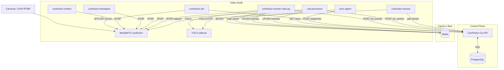

# Arquitetura — módulos ConfVision (workers Python)

Documento de auditoria técnica (fotografia do código em `core4/confvision/`).  
**Não substitui** runbooks de deploy (`DEPLOY_EASYPANEL.md`, `easypanel/README.md`).

Relacionados: ConfVision Go (`home/confmonit/v4.0/confvision/`), piloto Rust (`confvision-rust-processor/`).

---

## 1. Resumo executivo

Os apps EasyPanel **`confvision-dvr`**, **`confvision-motion`**, **`confvision-sensor`**, **`confvision-sync-agent`** e **`confvision-timelapse`** são **processos Python distintos** sobre o **mesmo repositório e imagem Docker** (`confvision/`), com entrypoints diferentes.

- **Gravação contínua (DVR):** MediaMTX grava fMP4 no disco; o worker DVR configura paths via API MTX e envia segmentos ao S3 + metadados na API.
- **Motion / Timelapse:** consomem **RTSP**, detectam movimento com **OpenCV MOG2**, encodam com **ffmpeg**, reutilizam pipeline de segmento (`dvr_segment.py`). **Não geram** eventos analíticos `vis_evento` de detecção humana.
- **Sensor:** faz **poll** de eventos sensor **já criados** na API e captura mídia (RTSP) para enriquecer o registro.
- **Sync-agent:** puxa configuração da API e publica cache **Redis** (ou memória) para outros workers — **arquivos `sync_agent*.py` / `config_cache.py` podem estar ausentes** na pasta `confvision/` dependendo do branch; ver § Inventário.

**Detecção humana / fila `confvision:eventos` / integrações analíticas clássicas** ficam no **`confvision-worker`** (`main.py`), **fora** desta lista de cinco apps, mas são **obrigatórios** para o comportamento “como antes” na maioria dos clientes.

---

## 2. Inventário dos módulos

| App EasyPanel | Entry point | Arquivos centrais |
|---------------|-------------|-------------------|
| confvision-dvr | `dvr_main.py` | `dvr_watcher.py`, `dvr_segment.py`, `mediamtx_client.py` |
| confvision-motion | `motion_main.py` | `motion_worker.py`, `motion_detect.py` |
| confvision-sensor | `sensor_main.py` | `event_capture.py` (sensor) |
| confvision-sync-agent | `sync_agent_main.py` | `sync_agent.py`, `config_cache.py` |
| confvision-timelapse | `timelapse_main.py` | `timelapse_worker.py` |

Compartilhados: `config.py`, `xano_client.py`, `urls.py`, `sharding.py`, `gravacao_storage.py`, `bootstrap_check.py`, `requirements.txt`, `Dockerfile`.

---

## 3. Linguagem de cada módulo

Todos os cinco módulos:

| Item | Valor |
|------|--------|
| Linguagem | **Python** |
| Versão | **3.11** (`FROM python:3.11-slim` em `Dockerfile`) |
| Framework web | Nenhum (workers long-running, threads) |
| Build | `pip install -r requirements.txt`; imagem multi-stage implícita via Dockerfile |
| Docker | Sim — `Dockerfile` (worker default `main.py`); apps satélite alteram **Arguments** no EasyPanel |
| Config | `easypanel/*.env`, variáveis em `config.py` |
| Testes | **Não há** `test_*.py` no pacote `confvision/` |

**Dependências principais** (`requirements.txt`): `opencv-python-headless`, `ultralytics` (YOLO — uso principal no **worker analítico** `main.py`), `requests`, `python-dotenv`, `boto3`, `redis`, `psycopg2-binary`, `hashids`.  
Imagem inclui **ffmpeg** (apt) para motion/timelapse e compatibilidade com captura.

**Nota sync-agent:** `easypanel/README.md` aponta `python -u sync_agent_main.py`. Em alguns worktrees os arquivos existem na **raiz do monorepo piloto** (`sync_agent.py`, `config_cache.py`, `redis_client.py`) e **não** em `confvision/` — validar antes do deploy.

---

## 4. Responsabilidade de cada módulo

### 4.1 confvision-dvr

| Aspecto | Comportamento |
|---------|----------------|
| Função | Orquestrar gravação **contínua** e registrar segmentos no backend |
| RTSP direto | **Não** — MediaMTX grava a partir do stream publicado |
| FFmpeg no DVR | **Não** — record nativo MediaMTX (`recordFormat: fmp4`) |
| MediaMTX | **Sim** — REST `MEDIAMTX_API_BASE`, `enable_record` / `disable_record`, `recordPath`, `recordSegmentDuration` |
| Disco local | `DVR_RECORD_DIR` (default `/recordings`), layout `%path/%Y-%m-%d_%H-%M-%S` |
| Organização | Por path de stream (`stream_path_for_camera`) |
| Retenção | Worker **não** apaga por política de dias; upload S3 + POST API; local renomeia para `.uploaded` |
| Falhas | Retry upload (`DVR_UPLOAD_RETRIES`); watcher ignora `.part`/`.tmp`; estabilidade `DVR_STABLE_SEC` |
| Recuperação | `DvrWatcher` reprocessa arquivos estáveis; duplicata na API tratada como idempotência |

Câmeras elegíveis: `get_cameras_gravacao_ativas()` + `filter_gravacao_cameras(..., motion=False, timelapse=False)` (modo gravação contínua, não motion/timelapse).

### 4.2 confvision-motion

| Aspecto | Comportamento |
|---------|----------------|
| Detecção | **OpenCV MOG2** + contornos (`MOTION_MIN_AREA`) — **não YOLO** |
| CPU/GPU | **CPU** |
| Frames | RTSP via `cv2.VideoCapture(..., CAP_FFMPEG)`, `MOTION_FRAME_SKIP` |
| Saída | Clipes MP4 → `process_segment_file(..., tipo="movimento")` → S3 + `post_gravacao_segmento` |
| Eventos `vis_evento` analíticos | **Não** |

### 4.3 confvision-sensor

| Aspecto | Comportamento |
|---------|----------------|
| Origem | Poll `GET /vis_evento_query_sensor_pendentes` |
| Protocolo | HTTPS REST para API ConfVision (`XANO_BASE_URL` / `vision.confmonit2.com.br`) |
| ConfMonit | Evento sensor criado **upstream** (receptor); worker só **captura mídia** |
| Persistência | Via API → Postgres (`vis_evento`, clips); fluxo `processar_evento_sensor` → `event_capture` |

### 4.4 confvision-sync-agent

| Aspecto | Comportamento |
|---------|----------------|
| Sincroniza | Câmeras ativas, áreas, lista gravação |
| Fonte | `/vis_camera_sync_ativas` (unified) ou endpoints legacy |
| Destino | Redis keys `confvision:sync:{full|analitico|gravacao}:n{node}:w{worker}` ou memória |
| PostgreSQL | **Não** direto |
| Fila | **Não** — cache TTL (`CONFIG_CACHE_TTL_SEC`) |
| Duplicação | `config_version` / `since_version`, payload `unchanged` |
| Falhas | Log + sleep; fallback legacy API |

### 4.5 confvision-timelapse

| Aspecto | Comportamento |
|---------|----------------|
| Modo parado | 1 frame / `TIMELAPSE_FRAME_INTERVALO_SEG` → acumula → ffmpeg concat → MP4 timelapse |
| Modo movimento | ffmpeg clipes (similar motion) |
| Origem | RTSP + MOG2 |
| Agenda | Thread por câmera; loop `MOTION_SYNC_INTERVAL_SEC`; flush via API (`ack_flush_pedido`) |
| Idempotência | POST segmento + tratamento duplicate; manager start/stop por `camera_id` |

---

## 5. Dependências

| Serviço | Depende de | Obrigatório? | Se cair |
|---------|------------|--------------|---------|
| confvision-dvr | MediaMTX, API, RTMP/stream ativo, S3 (credenciais via API) | Sim | Sem gravação contínua nova |
| confvision-motion | MediaMTX RTSP, API gravação | Sim (modo movimento) | Sem clipes movimento |
| confvision-timelapse | Idem | Sim (modo timelapse) | Sem timelapse |
| confvision-sensor | API, RTSP câmera | Sim | Eventos sensor sem mídia |
| confvision-sync-agent | API; Redis (recomendado) | Não | Workers poll API direto (+ carga) |
| confvision-worker (`main.py`) | MTX, API, YOLO, Redis eventos | **Sim p/ analítico** | Sem detecção humana clássica |
| ConfVision Go | Postgres | **Sim** | Painel, eventos, metadados param |
| MediaMTX (`confvision` app) | — | **Sim p/ vídeo** | RTSP 404 em todos consumidores |
| confvision-rust-processor | API, RTSP, sidecar | Só câmeras `worker_id` Rust | Analítico Rust off para essas IDs |

---

## 6. Comunicação entre serviços

```text
confvision-dvr
    ↓ HTTPS — query gravação, ping worker, POST vis_gravacao_segmento
    ↓ ConfVision Go / Postgres
confvision (MediaMTX)
    ↓ REST — record on/off, recordPath
    ↓ filesystem — fMP4 (DVR_RECORD_DIR)
confvision-dvr (DvrWatcher)
    ↓ HTTPS — S3 upload (boto3)
    ↓ HTTPS — registro segmento

confvision-motion | confvision-timelapse
    ↓ RTSP (TCP) ← MediaMTX
    ↓ OpenCV — leitura frames, MOG2
    ↓ subprocess ffmpeg — MP4 local
    ↓ dvr_segment — S3 + API gravação
    ↓ HTTPS — vis_worker ping

confvision-sensor
    ↓ HTTPS — poll sensor pendentes, get camera, finalizar evento
    ↓ RTSP — capture.py

confvision-sync-agent
    ↓ HTTPS — vis_camera_sync_ativas (ou legacy)
    ↓ Redis SETEX — confvision:sync:*

confvision-rust-processor (referência)
    ↓ HTTPS — sync, ping, POST vis_evento
    ↓ RTSP — decode (ffmpeg/retort)
    ↓ HTTP — YOLO sidecar / ONNX
    ↓ Redis — confvision:eventos
```

**Não utilizado nos cinco módulos:** WebSocket, RabbitMQ/Kafka/NATS, Postgres direto (exceto caminhos opcionais em outros entrypoints com `EVENT_STORE=postgres`).

---

## 7. Fluxo de dados

### Gravação contínua (DVR)

```text
Câmera/DVR ──RTMP──► MediaMTX ──record──► DVR_RECORD_DIR/*.fmp4
                              ▲
                              │ API record ON (dvr_main sync)
confvision-dvr ──watcher──► upload S3 ──POST──► vis_gravacao_segmento (Go/Postgres)
```

### Gravação por movimento / timelapse

```text
MediaMTX ◄──RTSP── motion/timelapse worker (OpenCV)
                    └──ffmpeg──► clip/timelapse local ──► mesmo pipeline S3 + segmento API
```

### Sensor

```text
ConfMonit/receptor ──► vis_evento (sensor, pendente)
confvision-sensor ──poll API──► RTSP capture ──► finalizar evento + mídia
```

### Analítico (worker principal, referência)

```text
MediaMTX ◄──RTSP── confvision-worker ou rust-processor
                    └──YOLO──► POST vis_evento ──► integrações / terminal (Go)
```

---

## 8. Integração com confvision-rust-processor

| Capacidade | Rust | DVR | Motion | Timelapse | Sensor |
|------------|------|-----|--------|-----------|--------|
| RTSP decode/capture | Sim | Não | Sim (OpenCV) | Sim | Via capture |
| Motion (gate) | Sim (pixel/scene) | Não | MOG2 | MOG2 | Não |
| YOLO / pessoa | Sim | Não | Não | Não | Não |
| Gravação longa S3 | Clips de evento | Sim (MTX) | Clipes | Timelapse | Clipes evento |
| vis_evento analítico | Sim | Não | Não | Não | Enriquece sensor |
| vis_worker ping | Sim | Sim | Sim | Sim | Não |
| Redis eventos | Sim | Não | Não | Não | Não |
| /health, métricas | Sim | Logs only | Logs only | Logs only | Logs only |

**Conclusão:** Rust **substitui o worker analítico** (`main.py`) por câmera quando `worker_id` aponta para o processor. **Não substitui** DVR, motion recording nem timelapse. Evitar múltiplos consumidores RTSP pesados na mesma câmera sem coordenação.

---

## 9. Redis

| Uso | Quem | Chave / padrão |
|-----|------|----------------|
| Cache sync config | sync-agent | `confvision:sync:{kind}:n{node}:w{worker}` |
| Fila eventos analíticos | worker Rust / Python | `confvision:eventos` (+ DLQ) |
| Scheduler YOLO distributed | worker GEX44 | `confvision:yolo:queue` (modo distributed) |

DVR, motion, timelapse e sensor **não** publicam na fila de eventos analíticos.

---

## 10. PostgreSQL

Acesso **indireto** via API ConfVision Go:

- `vis_camera`, `vis_worker` — cadastro e ping
- `vis_evento`, `vis_evento_clip` — eventos e mídia
- `vis_gravacao_segmento`, `vis_gravacao_storage` — metadados DVR/motion/timelapse

Workers Python satélite **não** abrem conexão Postgres salvo configurações especiais (`EVENT_STORE=postgres` no fluxo de captura compartilhado).

---

## 11. MediaMTX

- App **`confvision`** (EasyPanel): `Dockerfile-mediamtx`, ingest RTMP, RTSP interno, **record** para DVR.
- Workers motion/timelapse/rust/worker: **clientes RTSP** de `MEDIAMTX_RTSP_BASE`.
- DVR: **cliente API** v3 (`MEDIAMTX_API_BASE`) para ligar/desligar record por path.

Sem MediaMTX ativo: paths `cam/{hash}` inexistentes → RTSP 404.

---

## 12. FFmpeg

| Contexto | Uso |
|----------|-----|
| MediaMTX | Record container (fMP4), não subprocess Python no DVR |
| motion_worker / timelapse | Subprocess encode RTSP → MP4 (libx264) |
| timelapse | concat demuxer para montar MP4 a partir de JPEGs |
| rust-processor | Decode H.264 (crate ffmpeg / retort), não gravação comercial longa |

---

## 13. YOLO

- **Ultralytics** no **`confvision-worker`** (`main.py`, `detector.py`, arquitetura legacy/distributed).
- **Sidecar HTTP** + opcional ONNX no **rust-processor**.
- **Motion / timelapse / DVR / sensor:** **sem YOLO**.

---

## 14. Arquitetura distribuída

Compatível **parcialmente** com o código atual:

- Sharding: `WORKER_SHARD_INDEX/TOTAL`, `MEDIAMTX_NODE_ID`, `MAX_CAMERAS`, `WORKER_ID` em queries API.
- Vários processors Rust com `PROCESSOR_ID` distintos.
- Sync-agent **por nó VPS** alimentando Redis.
- **Requisitos para escala real:** DVR record dir **colocalizado** com MediaMTX do nó; não compartilhar um único watcher de filesystem entre nós; leases por câmera; bus de jobs para upload.

---

## 15. Escalabilidade

| Alvo | Viabilidade com código atual | Gargalo dominante |
|------|------------------------------|-------------------|
| ~100 câmeras | Plausível com shards + limites | CPU motion/timelapse; disco DVR |
| ~1 000 | Parcial | RTSP fan-out MTX; API sync; S3 egress |
| 10 000+ | Requer redesign | 1 thread OpenCV/câmera; Postgres write rate |
| 100k–10M+ | Não | Edge ingest, multi-region, sem pull RTSP central |

Componentes a escalar horizontalmente: **workers motion/dvr/timelapse por shard**, **nós MediaMTX**, **instâncias Rust**, **réplicas API Go (leitura)**, **Redis cluster**, **Postgres read replicas + particionamento evento/gravação**.

---

## 16. Gargalos

- **CPU:** MOG2 + ffmpeg por câmera (motion/timelapse); decode Rust + YOLO.
- **RAM:** buffers OpenCV/ffmpeg; filas Rust.
- **Rede:** RTSP duplicado (worker + motion + rust na mesma cam); upload S3.
- **Disco:** `DVR_RECORD_DIR` + `/tmp` motion; sem GC agressivo local.
- **API:** poll sync sem agent; N workers × intervalo.
- **Postgres:** inserts `vis_evento` + `vis_gravacao_segmento` em pico.

---

## 17. Pontos únicos de falha

1. **ConfVision Go + Postgres** — indisponibilidade global.
2. **MediaMTX único** por site — todos os streams caem.
3. **Redis central** — cache sync + fila eventos (modo redis).
4. **`confvision-worker` ausente** — analítico Python off (Rust só cobre câmeras atribuídas).
5. **Repo incompleto** — sync-agent sem arquivos no context Docker `confvision/`.
6. **Integração dispatch Go** — stub (`maybeScheduleIntegracaoDispatch` vazio) pode impedir dispatch automático pós-evento no caminho Go.

---

## 18. Recomendações (sem implementação)

1. Garantir **`sync_agent.py` / `config_cache.py` / `redis_client.py`** dentro de `confvision/` ou documentar build context monorepo.
2. Separar **data plane analítico** (Rust ou worker Python) de **gravação comercial** (DVR/motion/timelapse) por `worker_id` e flags de câmera.
3. Recriar **`confvision-worker`** antes de escalar piloto Rust para clientes em produção.
4. Adicionar métricas (Prometheus) e testes de integração mínimos por entrypoint.
5. Implementar dispatch de integração no Go ou centralizar no worker que já fala com Moni/terminal.
6. Política explícita de **retenção disco local** pós-upload no DVR.

---

## 19. Arquitetura futura sugerida

```text
                    CONFVISION CONTROL PLANE (Go)
                              │
                    PostgreSQL + Redis
                              │
              ┌───────────────┼───────────────┐
              │               │               │
        sync-agent      event consumer   API clients
        (config cache)  (Redis→PG)       (painel)
              │               │
              └───────┬───────┘
                      │
         ┌────────────┼────────────┐
         │ VIDEO NODE (por site)  │
         │  MediaMTX              │
         │  DVR orchestrator      │
         │  motion/timelapse pool │
         │  rust-processor shard  │
         │  yolo sidecar/GPU      │
         └────────────────────────┘
```

- **Go:** API, auth, metadados, orquestração, terminal, futuro job scheduler.
- **Rust:** analítico RTSP/YOLO por câmera, admission, health.
- **Python:** DVR API MTX + upload, motion/timelapse MOG2+ffmpeg, sensor capture, YOLO legacy onde GPU cluster existir.
- **FFmpeg/MediaMTX:** ingest, record nativo, transcode timelapse/clips.

---

## 20. Diagrama Mermaid



---

## Histórico

| Data | Nota |
|------|------|
| 2026-09-29 | Auditoria inicial a partir de `core4/confvision/` |
