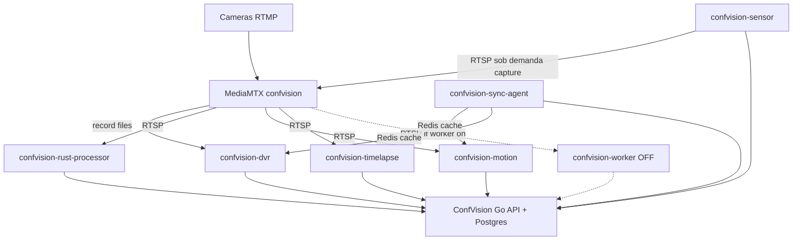
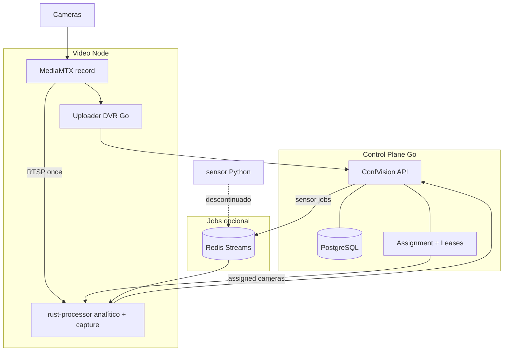

# Auditoria de migração — serviços Python × confvision-rust-processor

**Objetivo:** decidir, com base no **código real**, o que migrar para Rust, Go ou manter — **sem implementar** nada nesta etapa.

**Referências:** [ARQUITETURA_MODULOS_CONFVISION.md](./ARQUITETURA_MODULOS_CONFVISION.md), [ARQUITETURA_CONFVISION_ESCALA.md](./ARQUITETURA_CONFVISION_ESCALA.md).

**Código analisado:**

- Python workers: `core4/confvision/` (`dvr_main.py`, `motion_main.py`, `sensor_main.py`, `timelapse_main.py`, `xano_client.py`, …).
- Sync-agent: implementação em `core4-rust-pilot/sync_agent.py` + `config_cache.py` ( **não presentes** em `core4/confvision/` — ver §7).
- Rust: `core4-rust-pilot/confvision-rust-processor/src/` (branch piloto).

**Contexto operacional declarado:** `confvision-worker` (`main.py`) **desabilitado**; analítico em transição para Rust.

---

## 1. Objetivo

1. O que os cinco serviços **realmente** fazem no código.
2. O que o Rust **já substitui** (implementado, não documentado).
3. O que o Rust **ainda não** substitui.
4. Duplicações (RTSP, decode, motion).
5. Destino: Rust / Go / manter / absorver / descontinuar.
6. Ordem segura de migração e critérios de desligamento.

---

## 2. Estado atual

```text
ConfVision Go (API/Postgres)
        ↑ HTTP
        ├── confvision-rust-processor (analítico, worker_id Rust)
        ├── confvision-dvr
        ├── confvision-motion
        ├── confvision-timelapse
        ├── confvision-sensor
        └── confvision-sync-agent (se arquivos no image)

confvision-worker (main.py) — DESABILITADO

MediaMTX (app confvision) — ingest + record fMP4 (DVR)
```

---

## 3. confvision-worker desabilitado

| Item | Código |
|------|--------|
| Entry | `main.py` / `distributed_main.py` |
| Função | RTSP OpenCV, MOG2 gate (`motion_detect.py`), YOLO (`detector.py`), Redis `confvision:eventos`, POST `/vis_evento`, RTMP publish |
| Substituto em produção | **`confvision-rust-processor`** para câmeras com `worker_id` Rust |
| Risco | Câmeras ainda com `worker_id` Python **sem processador**; gravação motion/timelapse **independente** do worker analítico |

---

## 4. Inventário dos serviços

### 4.1 confvision-dvr

| Campo | Valor |
|-------|--------|
| Linguagem | Python 3.11 |
| Framework | Nenhum |
| Entry | `dvr_main.py` |
| Arquivos | `dvr_watcher.py`, `dvr_segment.py`, `mediamtx_client.py`, `gravacao_storage.py` |
| Deps | `requests`, `boto3` |
| APIs | `GET` gravação ativas, `POST` `vis_gravacao_segmento`, `POST` ping (`xano_client`) |
| Redis | Indireto se `CONFIG_CACHE_BACKEND=redis` em `get_cameras_gravacao_ativas` |
| PostgreSQL | **Não** direto |
| MediaMTX | **Sim** — REST v3 record on/off |
| FFmpeg | **Não** no DVR |
| OpenCV | **Não** |
| Comunicação | API Go, MTX API, S3 |
| Docker | Mesmo `Dockerfile` worker; comando `-u dvr_main.py` |
| Env | `easypanel/dvr.env`, `DVR_*` em `config.py` |

### 4.2 confvision-motion

| Campo | Valor |
|-------|--------|
| Entry | `motion_main.py` → `motion_worker.py` |
| OpenCV | **Sim** — MOG2, `VideoCapture` RTSP |
| FFmpeg | **Sim** — subprocess grava clip MP4 durante movimento |
| APIs | gravação ativas, ping; **não** POST `vis_evento` analítico |
| Saída | `dvr_segment.process_segment_file(..., tipo="movimento")` → S3 + segmento API |
| MediaMTX | RTSP client |
| Env | `MOTION_*`, `easypanel/motion.env` |

### 4.3 confvision-timelapse

| Campo | Valor |
|-------|--------|
| Entry | `timelapse_main.py` → `timelapse_worker.py` |
| Captura | RTSP OpenCV; JPEGs periódicos; ffmpeg concat → MP4 timelapse |
| Movimento | Mesmo MOG2 + ffmpeg clipes que motion |
| Agenda | Thread/câmera + `MOTION_SYNC_INTERVAL_SEC`; flush via `ack_flush_pedido` |
| Storage temp | `MOTION_RECORD_DIR/timelapse/{camera_id}` |
| Env | `TIMELAPSE_FRAME_INTERVALO_SEG`, `TIMELAPSE_FRAMES_POR_SEGMENTO` |

### 4.4 confvision-sensor

| Campo | Valor |
|-------|--------|
| Entry | `sensor_main.py` |
| Loop | Poll `GET /vis_evento_query_sensor_pendentes` |
| Fluxo | `processar_evento_sensor` → `event_capture.processar_deteccao` (RTSP, snapshot, clip, S3, finalizar) |
| Cria evento? | **Não** — evento já existe na API |
| PostgreSQL | Via API apenas |

### 4.5 confvision-sync-agent

| Campo | Valor |
|-------|--------|
| Entry | `sync_agent_main.py` → `agent_loop()` |
| Código no repo | **`core4-rust-pilot/sync_agent.py`**; em `core4/confvision/` **faltam** `sync_agent.py`, `sync_agent_main.py`, `config_cache.py`, `redis_client.py` (mas `Dockerfile-mediamtx` **referencia** `config_cache.py`) |
| Sync | `GET /vis_camera_sync_ativas` ou legacy 3 endpoints |
| Redis | `confvision:sync:{full|analitico|gravacao}:n{node}:w{worker}` |
| Ownership / lease | **Não existe** no código |
| Heartbeat | **Não** — só loop interval |
| Dependentes | `xano_client.get_cameras_ativas` / `get_cameras_gravacao_ativas` se cache redis |

### 4.6 confvision-rust-processor

| Campo | Valor |
|-------|--------|
| Linguagem | Rust (edition 2021, ver `Cargo.toml`) |
| Entry | `src/main.rs` → bin `confvision-rust-processor` |
| Docker | `confvision-rust-processor/Dockerfile`, features `ffmpeg-decode`, `jemalloc`; opcional `yolo-onnx` |
| APIs | `sync_cameras_ativas`, `vis_worker_ping`, `POST vis_evento`, `finalizar`, stream health (`api/client.rs`, `api/evento.rs`) |
| Redis | `events/queue.rs` — List/memory, key `EVENT_QUEUE_KEY` |
| RTSP | `rtsp/`, `camera_worker.rs` |
| Decode | `decode/` (ffmpeg-next CPU; retort path) |
| Motion | `motion/detector.rs` — **diff luma**, não MOG2 |
| YOLO | `yolo/http.rs`, `yolo/onnx.rs` (feature) |
| Capture evento | `capture/process.rs`, `capture/ffmpeg.rs` — snapshot/clip **por evento analítico** |
| S3 | `media/upload.rs` — requer env S3 no processor |
| Env | `easypanel.env.*`, `config.rs` |

---

## 5. confvision-rust-processor — capacidades (código)

Classificação: **IMPLEMENTADO** | **PARCIAL** | **PLACEHOLDER** | **NÃO EXISTE**

| Capacidade | Estado | Evidência (módulo) |
|------------|--------|---------------------|
| Conexão RTSP | **IMPLEMENTADO** | `rtsp/session.rs`, `worker/camera_worker.rs` |
| Captura frames / AU | **IMPLEMENTADO** | `rtsp_hotpath.rs`, pipeline |
| Decoder H.264 | **IMPLEMENTADO** (feature ffmpeg) | `decode/backend/cpu.rs` |
| Gerenciamento câmeras | **IMPLEMENTADO** | `camera/manager.rs`, sync API |
| Worker por câmera | **IMPLEMENTADO** | `worker/camera_worker.rs` |
| Reconexão / backoff | **IMPLEMENTADO** | `stream_policy/`, retry env |
| Health check | **IMPLEMENTADO** | `health/mod.rs`, `/health`, `/ready` |
| Métricas | **IMPLEMENTADO** | `metrics/mod.rs`, `/metrics`, capacity-report |
| Eventos analíticos | **IMPLEMENTADO** | `detection/coordinator.rs`, `api/evento.rs` |
| Redis fila eventos | **IMPLEMENTADO** | `events/queue.rs` |
| API Go | **IMPLEMENTADO** | `api/client.rs` |
| Motion detection | **IMPLEMENTADO** (algoritmo próprio) | `motion/detector.rs` — **não MOG2** |
| MOG2 OpenCV | **NÃO EXISTE** | — |
| YOLO | **IMPLEMENTADO** HTTP; **PARCIAL** ONNX (feature) | `yolo/http.rs`, `yolo/onnx.rs` |
| Processamento frames / pipeline | **IMPLEMENTADO** | `pipeline/frame_pipeline.rs` |
| Armazenamento S3 (evento) | **PARCIAL** | `media/upload.rs` — só se S3 env configurado |
| Gravação contínua DVR | **NÃO EXISTE** | sem `vis_gravacao_segmento` |
| Gravação clip movimento (modo gravação) | **NÃO EXISTE** | motion Python grava MP4 longo por MOG2 |
| Snapshots detecção | **IMPLEMENTADO** | `capture/snapshot.rs`, coordinator |
| Clips evento analítico | **IMPLEMENTADO** | `capture/ffmpeg.rs` + `capture/process.rs` |
| Timelapse inteligente | **NÃO EXISTE** | — |
| Sensor poll / pendentes | **NÃO EXISTE** | flags `captura_sensor` só no fluxo capture pós-evento |
| vis_gravacao_segmento | **NÃO EXISTE** | — |
| Camera assignment / lease | **NÃO EXISTE** | sharding estático apenas |
| Sync-agent / Redis config cache | **NÃO EXISTE** | Rust faz sync HTTP direto |

---

## 6. confvision-motion — comparação com Rust

| Aspecto | Python motion | Rust |
|---------|---------------|------|
| Abre RTSP | Sim, 1 thread/câmera OpenCV | Sim, por câmera analítica assignada |
| Decode | OpenCV/ffmpeg backend | ffmpeg-next / retort no pipeline |
| Motion | **MOG2** + contornos | **Luma diff** vs referência de cena |
| Gera `vis_evento` analítico | **Não** | **Sim** (YOLO + regras) |
| FFmpeg | Grava **clip contínuo** em movimento | Clip **curto** ligado a **evento** (`CLIP_DURACAO_SEG`) |
| S3 gravação segmento | Sim (`tipo=movimento`) | **Não** |
| Duplicação | **Sim**, se mesma câmera no Rust + motion | RTSP e “motion” semânticos diferentes |

### Classificação por função (motion)

| Função | Classificação | Motivo |
|--------|---------------|--------|
| Detecção movimento para **gravar clipe** | **MIGRAR PARA RUST** (futuro) | Rust não tem equivalente hoje; evitar 2º RTSP |
| MOG2 específico | **MANTER NO PYTHON** até paridade | Rust não implementa MOG2 |
| Encode clip movimento | **MIGRAR PARA RUST** ou **MANTER COMO ESTÁ** | Rust tem ffmpeg subprocess só para evento |
| POST segmento gravação | **MANTER COMO ESTÁ** (fora Rust) | API gravação não está no Rust |
| Analítico humano | **REMOVER APÓS MIGRAÇÃO** (worker off) | Já no Rust |

---

## 7. confvision-timelapse — comparação

| Etapa | Python (código) | Rust |
|-------|-----------------|------|
| Frames | RTSP read + save JPEG | Decode pipeline produz luma/JPEG possível |
| RTSP | OpenCV dedicado | Já conectado no analítico |
| OpenCV MOG2 | Sim | Não MOG2 |
| FFmpeg | concat timelapse + clip movimento | clip evento apenas |
| Agenda | Thread + contadores frames | Strides/env no Rust — **não** timelapse mode |
| Upload | `dvr_segment` | Não gravação segmento |

**Aproveitar pipeline Rust?** **Sim, arquiteturalmente** — hoje **NÃO EXISTE** modo timelapse no Rust. Timelapse precisa **frames esparsos + assemble batch**, não segundo RTSP.

| Função | Classificação |
|--------|---------------|
| Timelapse completo | **MIGRAR PARA RUST** (modo futuro) ou **MANTER COMO ESTÁ** até lá |
| Worker EasyPanel separado | **REMOVER APÓS MIGRAÇÃO** |

---

## 8. confvision-dvr — análise

| Pergunta | Resposta (código) |
|----------|-------------------|
| Quem grava? | **MediaMTX** (`record: true`, fMP4) |
| Papel Python | PATCH API + **watcher** filesystem + upload + POST |
| Detecção arquivos | Poll 5s, estabilidade tamanho `DVR_STABLE_SEC` |
| Upload | `gravacao_storage.upload_segment_file` (boto3) |
| Retry | `DVR_UPLOAD_RETRIES` |
| Registro API | `post_gravacao_segmento` |
| Duplicação | Mensagem API duplicate/unique |
| Retenção | **Não** no worker |

### Destino tecnológico

| Pergunta | Resposta |
|----------|----------|
| Continuar fora do Rust? | **Sim** — gravação massiva é MTX + uploader |
| Migrar para Go? | **Sim (recomendado)** — uploader idempotente, fila jobs |
| Colocar no Rust? | **Sem razão forte** — I/O bound, não decode contínuo analítico |

**Categoria serviço:** **B — MANTER COMO SERVIÇO INDEPENDENTE** (evoluir para **C — Go** uploader); **não A**.

---

## 9. confvision-sensor — análise

| Etapa | Código |
|-------|--------|
| Cria evento | **Receptor/ConfMonit** → API |
| Encontra | Poll `vis_evento_query_sensor_pendentes` |
| Câmera | `get_camera_by_id` |
| RTSP | `event_capture` / `capture.py` |
| Finaliza | `finalizar_evento`, upload S3 |
| Falhas | try/except por evento, loop continua |

**Rust hoje:** `capture/process.rs` trata `captura_sensor` no **plano de captura** após job de evento — **não** poll de pendentes.

**Evolução Event Bus → owner Rust:** **código atual não impede**, mas **não há** bus nem assignment; **pré-requisito** control plane Go.

**Categoria:** **B** agora; evolução **D** (absorver capture no nó Rust) + **C** (dispatch no Go).

---

## 10. confvision-sync-agent — análise

| Item | Existe no código? |
|------|-------------------|
| Sync config API → Redis | **Sim** (`write_sync`, `read_sync`) |
| Ownership câmera | **Não** |
| Heartbeat nó | **Não** |
| Assignment | **Não** |
| Failover | **Não** |
| Workers dependentes | `main.py` (off), dvr/motion/timelapse gravacao/analitico cache |

**Rust** faz **sync próprio** HTTP (`sync_cameras_ativas`) — **não usa** cache sync-agent.

**Destino:** **C — ABSORVIDO PELO CONTROL PLANE (Go)** + cache/assignment por nó; **E** para processo Python sync-agent após migração.

**Nota repo:** sync incompleto em `core4/confvision/` é **risco operacional** independente da migração Rust.

---

## 11. Matriz de migração (serviço × função)

| Serviço | Função | Tecnologia atual | Existe no Rust? | Estado no Rust | Destino recomendado | Prioridade |
|---------|--------|------------------|-----------------|----------------|---------------------|------------|
| rust-processor | Analítico RTSP/YOLO/evento | Rust | Sim | IMPLEMENTADO | **A — Rust** | P0 |
| worker (off) | Analítico legacy | Python | Parcial | Substituído por Rust | **E** | P0 |
| motion | Gravação clip movimento | Python MOG2+ffmpeg | Não | NÃO EXISTE | **E** após Rust/gravação | P2 |
| motion | RTSP dedicado | Python | Sim (analítico) | Duplicado | **E** | P1 |
| timelapse | Timelapse + clip | Python | Não | NÃO EXISTE | **E** após modo Rust/batch | P3 |
| dvr | MTX record config | Python API | Não | NÃO EXISTE | **B/C** manter/Go | P2 |
| dvr | Watcher + S3 + POST segmento | Python | Não | NÃO EXISTE | **C — Go** | P2 |
| sensor | Poll pendentes | Python | Não | NÃO EXISTE | **C — Go** | P3 |
| sensor | Capture RTSP mídia | Python | Parcial | capture/process | **D — Rust capture** | P3 |
| sync-agent | Config cache Redis | Python | Não | NÃO EXISTE | **C — Go CP** | P1 |

---

## 12. Matriz função por função

| Função | Serviço atual | Código atual | Rust possui? | Migrar? | Observação |
|--------|---------------|--------------|--------------|---------|------------|
| RTSP analítico | worker (off) / rust | OpenCV / retort | Sim | **Sim** (feito) | worker off |
| RTSP gravação motion | motion, timelapse | OpenCV | Só analítico | **Sim** | Fan-out |
| Decode analítico | rust | ffmpeg-next | Sim | — | |
| Decode motion | motion | OpenCV | Não | **Sim** | Usar decode Rust |
| Motion gate analítico | rust | luma diff | Sim | — | ≠ MOG2 |
| Motion MOG2 gravação | motion, timelapse | motion_worker | Não | **Parcial** | Paridade ou gate Rust |
| YOLO | rust / sidecar | http+onnx | Sim | — | |
| Snapshot evento | rust, sensor | capture | Sim | **Sensor → Rust** | |
| Clip evento | rust, sensor | ffmpeg subprocess | Sim | **Sensor → Rust** | |
| Clip gravação movimento | motion | ffmpeg long | Não | **Sim** | Não confundir com clip evento |
| Timelapse | timelapse | JPEG+concat | Não | **Sim** | Modo futuro |
| DVR record | MTX + dvr | mediamtx_client | Não | **Não (Rust)** | MTX permanece |
| Upload segmento S3 | dvr, motion, timelapse | gravacao_storage | Parcial (evento) | **Go job** | |
| POST vis_gravacao_segmento | dvr, motion | xano_client | Não | **Go** | |
| Sensor poll | sensor | sensor_main | Não | **Go** | |
| Eventos analíticos | rust | vis_evento | Sim | — | |
| Redis eventos | rust | events/queue | Sim | — | |
| Config sync cache | sync-agent | config_cache | Não | **Go CP** | |
| Assignment/lease | — | — | Não | **Go CP** | Pré-requisito escala |
| Health/metrics | rust | /health | Sim | — | Python sem HTTP |
| Retry upload | dvr | DVR_UPLOAD_RETRIES | Parcial | **Go** | |

---

## 13. Duplicações (escala)

### 13.1 Mesma câmera — analítico Rust + motion/timelapse Python

```text
Câmera → RTMP → MediaMTX
                  ├── RTSP → confvision-rust-processor (decode + motion gate + YOLO)
                  ├── RTSP → confvision-motion (OpenCV + MOG2 + ffmpeg)
                  └── RTSP → confvision-timelapse (OpenCV + MOG2 + ffmpeg)
```

**Problema de escala:** **Sim** — ~3× conexões RTSP e decode CPU se modos coincidirem.

### 13.2 Mesma câmera — Rust capture evento + RTSP sensor

Se sensor dispara capture enquanto Rust já decodifica: **2º RTSP** via `capture/ffmpeg.rs` — **PARCIAL** duplicação.

### 13.3 DVR record + Rust RTSP

```text
MediaMTX ──record──► disco (sem decode app)
         └──RTSP──► Rust (decode)
```

**Não é duplicação de decode** — record MTX é caminho separado; **OK**.

### 13.4 Sync API

sync-agent + cada worker Rust sync + (se worker Python voltasse) — **múltiplas leituras** da mesma config — **problema moderado** em escala API.

### 13.5 Motion detection duplicado

Rust **luma gate** + Python **MOG2** na mesma câmera — **semântica diferente**, mas **custo duplicado** se ambos ativos.

---

## 14. Decisão arquitetural (A–E) por serviço

| Serviço | Categoria | Justificativa (código) |
|---------|-----------|------------------------|
| **confvision-rust-processor** | **A — MIGRAR PARA RUST** (núcleo) | Já implementa analítico, RTSP, eventos, health |
| **confvision-worker** | **E — DESCONTINUAR** | Desabilitado; paridade analítica no Rust |
| **confvision-motion** | **E — DESCONTINUAR APÓS MIGRAÇÃO** | Função gravação não existe no Rust; RTSP duplicado; manter **B** até paridade clip/segmento |
| **confvision-timelapse** | **E — DESCONTINUAR APÓS MIGRAÇÃO** | Timelapse **NÃO EXISTE** no Rust; **B** interim |
| **confvision-dvr** | **B — MANTER INDEPENDENTE** → **C Go** | MTX grava; Rust sem `vis_gravacao_segmento` |
| **confvision-sensor** | **B** → **D + C** | Poll **C Go**; capture **D Rust** (`capture/process` já próximo) |
| **confvision-sync-agent** | **C — CONTROL PLANE Go** + **E** | Sem lease; Rust não usa cache |

---

## 15. Ordem segura de migração

### FASE 1 — Estabilizar analítico Rust (substituir worker off)

| Item | Detalhe |
|------|---------|
| Pré-requisitos | Câmeras analíticas com `worker_id` Rust; sidecar YOLO; Redis; API Go |
| Código | `confvision-rust-processor/*`, env EasyPanel |
| APIs | `vis_camera_sync_ativas`, `vis_worker_ping`, `vis_evento` |
| Riscos | `events_published=0`, CPU, admission |
| Teste | `/health`, `capacity-report`, `vis_evento` por câmera piloto |
| Rollback | Reassign `worker_id` Python + reativar worker (se ainda deployável) |
| Desligar worker | **Já off** — critério: eventos analíticos OK no Rust |

### FASE 2 — Observabilidade e paridade capture

| Item | Detalhe |
|------|---------|
| Pré-requisitos | Fase 1 |
| Código | Rust metrics; validar `capture/process.rs` + S3 env |
| Teste | Snapshot/clip evento vs baseline Python histórico |
| Rollback | Desabilitar `CAPTURE_ENABLED` |

### FASE 3 — Sync / assignment (Go) — antes de matar fan-out

| Item | Detalhe |
|------|---------|
| Pré-requisitos | API assignment desenhada |
| Código | Go CP; deprecar `sync_agent` Python |
| APIs | Novo endpoint assigned cameras; manter ping |
| Riscos | Stale config |
| Rollback | Redis cache legacy + sync-agent Python |
| Desligar sync-agent | Ver §16 sync-agent |

### FASE 4 — Sensor (reorganizar, não bloquear Rust)

| Item | Detalhe |
|------|---------|
| Pré-requisitos | Fase 2 capture Rust; opcional Fase 3 ownership |
| Código | Go consumer pendentes; Rust ou Python capture |
| Teste | Evento sensor com mídia |
| Rollback | Manter `sensor_main.py` poll |
| Desligar sensor Python | Critérios §16 sensor |

### FASE 5 — Motion gravação (paridade antes de E)

| Item | Detalhe |
|------|---------|
| Pré-requisitos | **Implementação futura** clip gravação no Rust **ou** Go usando frames Rust — **hoje NÃO EXISTE** |
| Arquivos hoje | `motion_worker.py`, `dvr_segment.py` |
| Riscos | Perda gravação movimento |
| Rollback | Reativar motion app |
| Desligar motion | §16 motion |

### FASE 6 — Timelapse

| Item | Detalhe |
|------|---------|
| Pré-requisitos | Fase 5 pattern (frames compartilhados) |
| Código | `timelapse_worker.py` referência |
| Desligar timelapse | §16 timelapse |

### FASE 7 — DVR reorganização (Go uploader)

| Item | Detalhe |
|------|---------|
| Pré-requisitos | MTX estável; fila upload |
| Código | `dvr_*` Python referência |
| **Não migrar record para Rust** | MTX permanece |
| Desligar dvr Python | §16 dvr |

### FASE 8 — Escala horizontal

Assignment + multi-node MTX (ver ARQUITETURA_CONFVISION_ESCALA.md).

**Ordem escolhida por dependência real:** analítico Rust **antes** de desligar motion/timelapse; **assignment** antes de confiar em desligar sync-agent; **motion/timelapse** só após paridade gravação; **DVR** independente por último (menos conflito com Rust).

---

## 16. Critérios de desligamento

### confvision-worker (Python analítico)

- [x] Desabilitado operacionalmente
- [ ] Rust: detecção + POST evento validado por câmera produção
- [ ] Nenhuma câmera com `worker_id` Python analítico ativa
- [ ] Rollback: reassign + redeploy worker documentado

### confvision-motion

Desligar **somente quando:**

- [ ] Câmeras `modo_gravacao=movimento` atendidas por nova implementação (Rust ou Go+frames)
- [ ] Clipes validados (S3 + `vis_gravacao_segmento`)
- [ ] Reconexão RTSP validada
- [ ] Comparação MOG2 vs gate Rust aceita pelo produto **ou** paridade MOG2
- [ ] Zero câmeras motion no Python shard
- [ ] Rollback: reativar app motion EasyPanel

### confvision-timelapse

- [ ] Modo timelapse implementado fora do Python **ou** câmeras timelapse desativadas
- [ ] Segmentos timelapse validados
- [ ] Flush API validado
- [ ] Rollback: reativar timelapse app

### confvision-dvr

- [ ] Uploader Go (ou Python) + MTX record validados em paralelo
- [ ] Idempotência segmento validada
- [ ] Upload lag monitorado
- [ ] Rollback: manter dvr Python

### confvision-sensor

- [ ] Fluxo alternativo (Go poll + Rust capture) validado
- [ ] Latência ≤ baseline
- [ ] Rollback: sensor_main.py

### confvision-sync-agent

- [ ] Go assignment + cache por nó
- [ ] Workers/Rust não dependem de `get_cameras_*_cached` Python
- [ ] Rollback: sync-agent + Redis keys legadas

---

## 17. Riscos

| Risco | Impacto |
|-------|---------|
| Desligar motion/timelapse cedo | Perda gravação contratual |
| Rust sem S3 env | Eventos sem mídia |
| sync-agent ausente no repo | Workers gravacao quebram import |
| Duplo RTSP Rust+motion | CPU 98% / instabilidade (observado em piloto) |
| Sem lease | Failover double-process |

---

## 18. Plano de rollback (geral)

1. Postgres: restaurar `worker_id` anterior por câmera.
2. EasyPanel: Start serviço Python desligado.
3. Rust: Stop ou `MAX_CAMERAS=0` / drain.
4. Redis: limpar fila se necessário (cuidado DLQ).
5. Validar RTMP/404 antes de analítico.

---

## 19. Arquitetura atual (Mermaid)



---

## 20. Arquitetura futura recomendada (Mermaid)



---

## 21. Recomendações finais

1. **Não migrar DVR para Rust** — manter MTX record + evoluir uploader (**Go**).
2. **Não desligar motion/timelapse** até existir no código Rust (ou Go) equivalente a `process_segment_file` + clip/timelapse **sem segundo RTSP**.
3. **Tratar rust-processor como substituto do worker analítico** — foco P0 produção.
4. **Resolver sync-agent no repo** (`config_cache.py` etc.) ou remover dependência quebrada em `xano_client`.
5. **Implementar assignment no Go** antes de escala multi-nó — Rust **não tem** lease hoje.
6. **Sensor:** evoluir para bus + capture no **owner** (Rust já tem `capture/process.rs` parcial).

---

## 22. Validação pré-migração (revisão código)

Correções em relação a diagramas/textos anteriores:

| Item | Ajuste |
|------|--------|
| **Sensor × RTSP** | `sensor_main.py` **não** mantém RTSP contínuo; abre RTSP só em `event_capture.processar_deteccao` por evento pendente. |
| **YOLO ONNX** | Código em `yolo/onnx.rs` existe, mas imagem release usa `ffmpeg-decode` **sem** `yolo-onnx` por padrão — produção típica = **HTTP sidecar**. |
| **Eventos Rust** | Fluxo em **duas etapas**: `detection/coordinator.rs` publica job → workers `capture/process.rs` + `api/evento.rs` (POST/finalizar). |
| **Redis “substituído”** | Rust substitui fila **de eventos analíticos** (`events/queue.rs`), **não** o cache `confvision:sync:*` do sync-agent. |
| **Motion gravação** | Durante clip, **2× RTSP** na mesma câmera: OpenCV (MOG2) + ffmpeg `-i` (`motion_worker._start_ffmpeg`). |
| **config_cache / redis_client** | **Ausentes** em `core4/confvision/`; presentes em `core4-rust-pilot/` (raiz piloto) e forks `ConfVision*`. `Dockerfile-mediamtx` exige COPY local — **build quebrado** se contexto = só `confvision/` sem esses arquivos. |

Demais conclusões da auditoria **confirmadas** na validação — ver [PLANO_MIGRACAO_RUST.md](./PLANO_MIGRACAO_RUST.md).

---

## Histórico

| Data | Autor | Nota |
|------|-------|------|
| 2026-09-29 | Auditoria migração | Base código `core4/confvision` + `core4-rust-pilot/confvision-rust-processor` |
| 2026-09-29 | Validação pré-migração | §22; diagrama §19 sensor; plano em PLANO_MIGRACAO_RUST.md |
