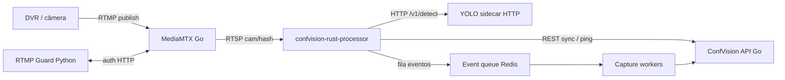

# Arquitetura — `confvision-rust-processor`

Documento de referência sobre como o processador Rust foi estruturado: integração com MediaMTX, pipeline de vídeo, YOLO e concorrência.

**Crate:** `confvision-rust-processor`  
**Entrada:** `src/main.rs`  
**Dependências:** `Cargo.toml`

Documentos relacionados:

- [RUNBOOK_YOLO_SIDECAR.md](./RUNBOOK_YOLO_SIDECAR.md)
- [TROUBLESHOOTING_RTSP_ERRORS.md](./TROUBLESHOOTING_RTSP_ERRORS.md)
- [LOAD_ADMISSION.md](./LOAD_ADMISSION.md)
- [RUNBOOK_CAMERAS_404_ATIVO.md](./RUNBOOK_CAMERAS_404_ATIVO.md)

---

## Respostas rápidas

| Pergunta | Resposta |
|----------|----------|
| O MediaMTX que usamos é em Go? | **Sim.** Binário [bluenviron/mediamtx](https://github.com/bluenviron/mediamtx). No deploy ConfVision roda no container `Dockerfile-mediamtx` (repo `core4/confvision`), junto com o **guard RTMP em Python** — não dentro do binário Rust. |
| YOLO via ONNX Runtime em Rust? | **Implementado** (feature `yolo-onnx`, crate `ort`). Piloto continua em **`YOLO_BACKEND=http`** por padrão; ONNX evita JPEG/Base64/HTTP no hot path (`infer_luma_sync`). |
| Tokio para múltiplos fluxos? | **Sim.** Runtime `rt-multi-thread`; **uma task Tokio por câmera**, producer/consumer RTSP em tasks separadas, mais workers de capture, sync, ping e load shedding. |
| Ponte Rust ↔ YOLO? | Enum **`YoloRuntime`** (`Off` \| `Http` \| `Onnx`): JPEG do frame decodificado → `infer_jpeg` → HTTP `POST /v1/detect` ou (futuro) ONNX in-process. Regras de negócio em **`DetectionContext`**. |

---

## 1. Ecossistema



- O **Rust não embute o MediaMTX**. Consome **RTSP** (ex.: `rtsp://host:8554/cam/{hash12}`), alinhado ao worker Python via `src/camera/stream_url.rs` e Hashids (`RTMP_PUBLISH_SECRET`).
- **Controle** (lista de câmeras, ping, health de stream): `ConfVisionClient` (`reqwest`) → API central Go.
- **Ingestão RTMP:** câmeras publicam no MediaMTX; o processador **lê** o mesmo path em RTSP.

---

## 2. Estrutura de módulos (`src/`)

| Módulo | Responsabilidade |
|--------|------------------|
| `main.rs` | Bootstrap: config, YOLO, analytics, fila de eventos, HTTP Axum, `CameraManager`, loops sync/ping/shutdown. |
| `camera/` | `CameraManager`: sync, admission, load shedding, **um worker por câmera**; montagem de URL RTSP. |
| `worker/camera_worker.rs` | Ciclo RTSP: reconexão, política de stream, pipeline producer/consumer. |
| `rtsp/` | Cliente **retina**: connect, demux H.264, enfileiramento na pipeline. |
| `pipeline/` | Fila bounded **drop-oldest** + consumer async (decode → motion → detecção). |
| `decode/` | H.264 → plano luma; opcional FFmpeg/NVDEC (`ffmpeg-decode`, `ffmpeg-nvdec`). |
| `motion/` | Movimento na luma; gate “analisar só com movimento”. |
| `yolo/` | `YoloRuntime`, cliente HTTP, stub ONNX. |
| `detection/` | `DetectionContext`: stride, semáforo, áreas, cooldown, enqueue de eventos. |
| `events/` + `capture/` | Fila pós-match; workers publicam via API. |
| `load/` + `capacity/` | Admission e load shedding (CPU/capacidade). |
| `api/` | Cliente REST ConfVision. |
| `health/` + `metrics/` | `/health`, `/metrics`, `/capacity-report` (incl. RTSP 404 no MediaMTX). |
| `stream_policy/` | Classificação de falhas RTSP, backoff, ações de health. |
| `sharding/` | Filtro de câmeras por shard do worker. |
| `redis/` | Bootstrap da fila de eventos quando configurado. |

---

## 3. Fluxo de dados

### 3.1 Visão por câmera (hot path)

1. **Sync loop** — API devolve câmeras do worker/shard → `CameraManager` inicia ou para `run_camera_worker`.
2. **URL RTSP** — `mediamtx_rtsp_base` + `cam/{hash}` ou `rtsp_url_sec` explícita.
3. **Producer** (`rtsp/session.rs`, loop em `camera_worker.rs`):
   - `connect_rtsp_demuxed` (retina, TCP, `FrameFormat::MP4`).
   - Cada access unit vira `PipelineFrame` (`Arc<[u8]>` — move do buffer retina).
   - `MotionEnqueueGate` pode suspender RTSP em idle.
4. **Fila** (`FramePipeline`) — capacidade `frame_buffer_max`; se cheia → **descarta o mais antigo** (producer não bloqueia).
5. **Consumer** (`run_frame_consumer` em `pipeline/frame_pipeline.rs`):
   - `H264Decoder` + extradata da sessão.
   - `MotionDetector` na luma.
   - Com YOLO habilitado: `tokio::spawn` → `DetectionContext::on_decoded_frame`.
6. **Detecção** (`detection/coordinator.rs`):
   - Filtros: `yolo_enabled`, detecção humana, `yolo_frame_stride`, movimento/armed, fase “incident”.
   - Luma → **JPEG** (`image`).
   - `yolo.infer_jpeg(jpeg)`.
   - `evaluate_detections` (áreas, modo, conf mínima).
   - Match → snapshot + `EventJob` na fila.
7. **Capture workers** (`capture/workers.rs`) — consomem fila, lock por câmera, `processar_deteccao` → API ConfVision.

### 3.2 Diagrama linear

```text
RTSP (MediaMTX)
    │
    ▼
retina demux ──► DropOldestQueue ──► H264 decode ──► motion
                                              │
                                              ▼
                                    JPEG + YoloRuntime
                                              │
                                              ▼
                              rules / areas / cooldown
                                              │
                                              ▼
                                    EventQueue ──► capture ──► API Go
```

---

## 4. Integração YOLO

### 4.1 Abstração `YoloRuntime`

Definida em `src/yolo/runtime.rs`:

| Variante | Quando | Comportamento |
|----------|--------|----------------|
| `Off` | `YOLO_ENABLED=0` ou backend off | `infer_jpeg` retorna lista vazia. |
| `Http` | `YOLO_BACKEND=http` + `YOLO_HTTP_URL` | `reqwest` → `POST {url}/v1/detect` com `jpeg_base64`. |
| `Onnx` | `YOLO_BACKEND=onnx` + build `--features yolo-onnx` + `YOLO_MODEL_PATH` | `ort` + preprocess luma → NCHW; inferência em `spawn_blocking`. |

Bootstrap em `main.rs`: `YoloRuntime::bootstrap(&cfg)` → `Arc` compartilhado em `AppState` e `AnalyticsRuntime`.

### 4.2 Contrato HTTP (sidecar)

Implementação: `src/yolo/http.rs`.

- Request: JSON `{ "jpeg_base64": "..." }`.
- Response: `width`, `height`, `detections[]` com `class_id`, `confidence`, `xyxy`.
- Mapeamento para `PersonDetection` → regras em `detection/rules.rs` e `detection/areas.rs`.

Ver operação em [RUNBOOK_YOLO_SIDECAR.md](./RUNBOOK_YOLO_SIDECAR.md).

### 4.3 Pós-inferência (sempre no Rust)

- Stride de frames (`YOLO_FRAME_STRIDE`).
- Semáforo `YOLO_MAX_INFLIGHT` + modo async (`YOLO_INFER_ASYNC`).
- Cooldown por câmera, zonas de detecção, modo dentro/fora/ambos.
- Fila de eventos e pipeline de captura/upload de mídia.

---

## 5. Concorrência, memória e buffers

### 5.1 Modelo Tokio

- `#[tokio::main]` com features `rt-multi-thread`, `sync`, `time`, `signal`.
- **Uma `JoinHandle` por câmera** no `CameraManager`.
- Por sessão RTSP: **duas tasks** — demux (producer) + `run_frame_consumer` (consumer); shutdown via `watch::channel`.
- **Detecção:** `tokio::spawn` por frame elegível (consumer não espera YOLO).
- **YOLO async:** `Semaphore::new(yolo_max_inflight)`; se `try_acquire_owned` falha → `yolo_skipped_busy`.
- **Timeout:** `tokio::time::timeout` com `yolo_http_timeout_sec`.
- **Capture:** `capture_workers` tasks; `CaptureLocks` evita captura duplicada na mesma câmera.

### 5.2 Buffers e backpressure

| Componente | Política |
|------------|----------|
| `DropOldestQueue` | Capacidade fixa; overflow descarta frame **mais antigo**. |
| Payload H.264 | `Arc<[u8]>` na pipeline até o decode. |
| Estado da câmera | `RwLock` em `SharedCameraState`; producer usa `try_write` e stats pendentes se lock ocupado. |
| Frame decodificado | Luma em resolução fixa (`DECODED_LUMA_*`); clone para tasks de detecção quando necessário. |
| Notificação consumer | `tokio::sync::Notify` na `FramePipeline`. |

### 5.3 Controle de carga

- `LoadAdmissionGate` — pode adiar subida de câmeras sem headroom.
- `LoadSheddingCoordinator` — pode derrubar IDs sob CPU crítica (`LOAD_SHEDDING_ENABLED`).
- `CapacityEngine` + sampler — métricas para `/capacity-report`.

---

## 6. Crates principais

| Crate | Papel no projeto |
|-------|------------------|
| `tokio` | Runtime async, tasks, `RwLock`, `Semaphore`, `Notify`, `watch`. |
| `axum` | Servidor HTTP interno (health, metrics). |
| `retina` | Cliente RTSP/RTP e demux H.264. |
| `futures` | Stream no loop RTSP. |
| `reqwest` | API ConfVision + YOLO HTTP. |
| `redis` | Fila de eventos (feature `tokio-comp`). |
| `serde` / `serde_json` | Config, câmeras, payloads API/YOLO. |
| `image` | JPEG a partir da luma. |
| `hash-ids` (package `hashids`) | Path `cam/{hash12}`. |
| `tracing` / `tracing-subscriber` | Logs estruturados. |
| `chrono` | Timestamps. |
| `anyhow` / `thiserror` | Erros de aplicação. |
| `dotenvy` | Variáveis de ambiente. |
| `ffmpeg-next` *(opcional)* | Decode via libav com `ffmpeg-decode`. |
| `base64` | Body JSON para YOLO HTTP. |
| `wiremock` *(dev)* | Testes HTTP. |

| `ort` *(feature `yolo-onnx`)* | ONNX Runtime (download de binários no build + `tls-rustls`). |
| `tikv-jemallocator` *(feature `jemalloc`)* | Allocator global em Linux (Docker release). |

### Features Cargo

```toml
ffmpeg-decode = ["dep:ffmpeg-next"]
ffmpeg-nvdec = []     # política de aceleração; requer stack NVIDIA
jemalloc = ["dep:tikv-jemallocator"]   # ativo no Dockerfile release (Linux)
yolo-onnx = ["dep:ort"]                # YOLOv8 ONNX in-process
```

Build produção (EasyPanel): `cargo build --release --features ffmpeg-decode,jemalloc`  
ONNX opcional: acrescente `yolo-onnx` e monte `YOLO_MODEL_PATH` (ex.: `/app/models/yolov8n.onnx`).

---

## 7. Variáveis de ambiente (referência)

### MediaMTX / RTSP

- `MEDIAMTX_RTSP_BASE` — base RTSP do nó.
- `MEDIAMTX_NODE_ID` — sharding multi-nó.
- `RTMP_PUBLISH_SECRET` — salt Hashids para `cam/{hash}`.

### YOLO

- `YOLO_ENABLED`, `YOLO_BACKEND` (`off` \| `http` \| `onnx`)
- `YOLO_HTTP_URL`, `YOLO_HTTP_TIMEOUT_SEC`
- `YOLO_FRAME_STRIDE`, `YOLO_MAX_INFLIGHT`, `YOLO_INFER_ASYNC`
- `YOLO_CONF_DEFAULT`, `YOLO_MODEL_PATH` (onnx)
- `YOLO_ONNX_INPUT_SIZE` (default 640)

### Pipeline / carga

- `FRAME_BUFFER_MAX` (via config `frame_buffer_max`)
- `FRAME_BUFFER_POOL_MAX` (default 128) — pool global de `Vec<u8>` (`src/buffer/pool.rs`)
- `ANALYSIS_ONLY_ON_MOTION`, gates de movimento
- Variáveis de load shedding e capture — ver `src/config.rs` e [LOAD_ADMISSION.md](./LOAD_ADMISSION.md).

---

## 8. Boot sequence (`main.rs`)

Ordem resumida:

1. `Config::from_env()` + logging.
2. `events::bootstrap_event_queue`.
3. `YoloRuntime::bootstrap`.
4. `AnalyticsRuntime::bootstrap`.
5. `AccelerationRuntime` / política de decode.
6. `ConfVisionClient`, `spawn_capture_workers`.
7. `CameraManager` + loop de load shedding.
8. Axum (`/health`, `/ready`, `/metrics`, `/capacity-report`).
9. `run_sync_loop` + `run_ping_loop` (worker ping, stream health).
10. Graceful shutdown via sinal.

---

## 9. MediaMTX no repositório ConfVision (Go + Python)

Referência: `core4/confvision/Dockerfile-mediamtx`.

- Imagem base do binário: `FROM bluenviron/mediamtx:1 AS mtx`.
- Guard RTMP e scripts Python no mesmo container.
- Portas típicas: 1935 RTMP, 8554 RTSP, 8888 HLS, 9997 API, 8100 Guard.

O processador Rust **conecta-se como cliente RTSP**; não fala com a API MediaMTX diretamente no hot path (salvo diagnósticos operacionais documentados em runbooks).

---

## 10. Pronto hoje vs. quando adotar ONNX / jemalloc

| Capacidade | Estado | Notas |
|------------|--------|--------|
| YOLO HTTP sidecar | **Produção piloto** | `YOLO_BACKEND=http`, runbook sidecar |
| YOLO ONNX in-process | **Código pronto** | Requer redeploy com `--features yolo-onnx` + modelo ONNX |
| Pool de buffers | **Ativo** | JPEG encode + scratch luma pós-decode |
| jemalloc (Linux) | **Docker release** | Feature `jemalloc`; dev Windows usa allocator padrão |
| Pool global de frames H.264 | **Não** | Continua `Arc<[u8]>` move-from-retina + drop-oldest |

### Quando vale migrar para `YOLO_BACKEND=onnx`

- Métricas mostram gargalo em **timeout HTTP**, **`yolo_skipped_busy`** ou CPU em **encode JPEG/Base64**, não em decode puro.
- Há **CPU/GPU reservada** para inferência no mesmo host do processor (ONNX concentra carga no binário Rust).
- Modelo **YOLOv8 ONNX** Ultralytics-compatible em `YOLO_MODEL_PATH`.

Ganho **marginal** se poucas câmeras, stride alto e sidecar folgado — ajuste `YOLO_FRAME_STRIDE` / `YOLO_MAX_INFLIGHT` antes de trocar backend.

### Quando monitorar heap / jemalloc

- RSS do container **sobe por dias** com dezenas de câmeras → correlacionar com `FRAME_BUFFER_POOL_MAX` e métricas de host.
- jemalloc já reduz fragmentação típica em processo long-running **Linux**; não substitui admission/load shedding.

---

## 11. Melhorias de memória (implementação)

- **`src/buffer/pool.rs`**: pool global inicializado em `main` com `FRAME_BUFFER_POOL_MAX`.
- **Uso:** `luma_to_jpeg_bytes` (plano + buffer JPEG), realocação de `luma_scratch` após decode FFmpeg.
- **H.264 na fila:** inalterado — `Arc<[u8]>` sem cópia extra (`rtsp/session.rs`).

---

## 12. YOLO ONNX (implementação)

- **`src/yolo/onnx.rs`**: sessão `ort`, letterbox NCHW, inferência síncrona em thread pool Tokio.
- **`src/yolo/onnx_postprocess.rs`**: pós-processo YOLOv8 `[1, 84, N]` → `PersonDetection` (classe 0 pessoa).
- **`YoloRuntime::infer_frame`**: ONNX usa **luma direto**; HTTP mantém JPEG + POST.
- **`DetectionContext`**: só gera JPEG quando `uses_jpeg_for_infer()` (backend HTTP).

---

## 13. Roadmap restante

| Item | Estado |
|------|--------|
| RTSP + decode + motion + detecção | **Em uso** |
| ONNX GPU (CUDA/TensorRT via `ort`) | **Futuro** (hoje CPU `onnx-cpu`) |
| FFmpeg/NVDEC decode | **Feature opcional** |
| Paridade worker Python | **Em evolução** (Fases C–D) |

---

*Última revisão: setembro/2026 — ONNX `ort`, buffer pool, jemalloc no Docker Linux.*
