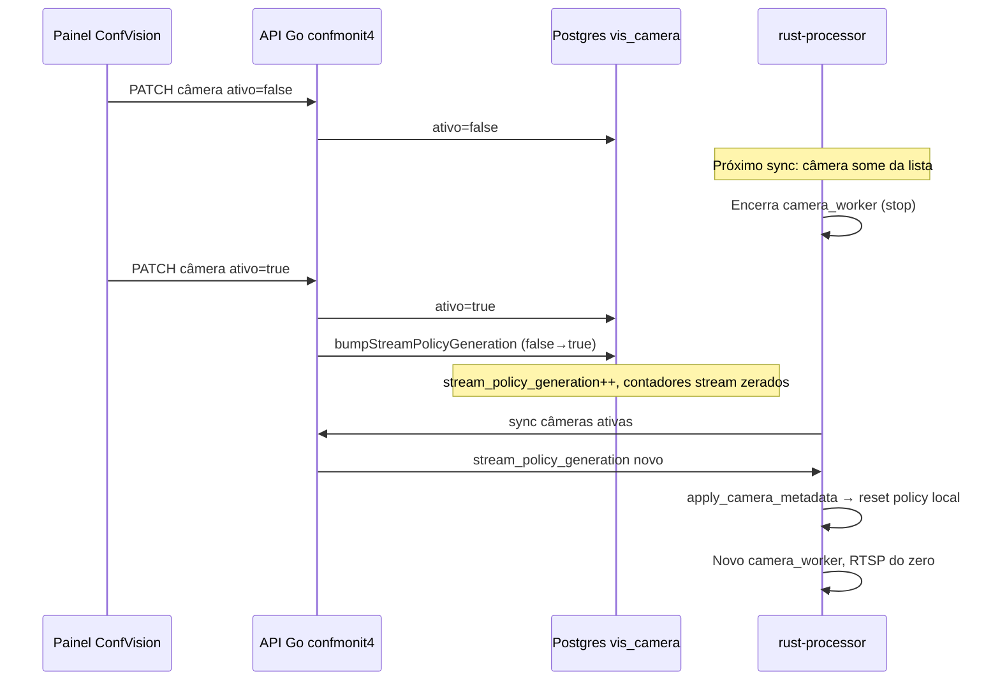
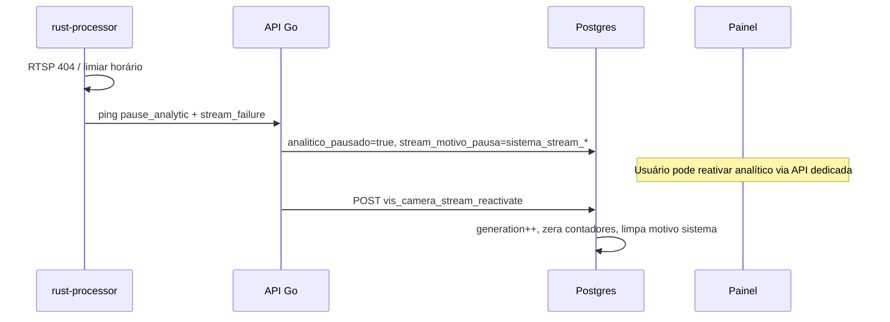

# Painel **Ativo** / **Inativo** vs stream policy

Documenta o fluxo **comercial** (ConfVision) versus a **política automática de RTSP** no processor Rust.

## Conceitos

| Conceito | Onde | Efeito |
|----------|------|--------|
| **`ativo`** | Postgres + painel | Se `false`, a câmera **não entra** no sync de câmeras ativas do worker → task da câmera **para** (sem loop RTSP). |
| **`analitico_pausado`** | Postgres + painel | Pode ser manual ou **`sistema_stream_*`** (automático). Analítico/YOLO pausado; RTSP pode continuar conforme config local. |
| **`stream_policy_generation`** | Postgres | Contador lógico; quando **sobe**, o Rust **zera** contadores locais de retry e recomeça política. |
| **Stream policy (Rust)** | Processor | Backoff, pausa analítica automática, ping `camera_stream_health`. |

**Importante:** togglar **Ativo** no painel **não** é restart de pod/container EasyPanel — é mudança de registro + sinal para o worker na próxima sync.

## Fluxo: usuário desativa e reativa câmera

### `bumpStreamPolicyGeneration` (Go)

Chamado em **UpdateCamera** quando `ativo` passa de **false → true**:

- `stream_policy_generation = stream_policy_generation + 1`
- `stream_falhas_consecutivas = 0`
- `stream_tentativas_horarias = 0`
- `stream_motivo_pausa = NULL` (limpa motivo automático; **não** força `analitico_pausado=false` se pausa foi manual)

Equivalente operacional a “reset comercial” de retry 404 / pausa por stream.

## Fluxo: sistema pausa analítico (404 / nunca OK)

`ReactivateCameraStream` **não** altera `ativo`; só destrava analítico quando pausa foi do sistema (`stream_motivo_pausa LIKE 'sistema_stream%'` ou `analitico_pausado`).

## Comparação rápida

| Ação | `ativo` | `stream_policy_generation` | Worker RTSP | Analítico |
|------|---------|----------------------------|-------------|-----------|
| Ativo **false** | false | — | Para | — |
| Ativo **true** (reativar) | true | **+1** | Inicia | Depende de `analitico_pausado` |
| `stream_reactivate` API | — | **+1** | Já rodando se ativo | Limpa pausa sistema |
| `stream_ok` (ping) | — | — | Conectado | Despausa se motivo era `sistema_stream%` |

## Sync Rust ↔ Postgres

No sync, cada câmera traz `stream_policy_generation` e `ultimo_stream_ok_em`. Se `generation` mudou, o Rust:

- Zera `failures_consecutive`, `hourly_attempts`, `next_probe_at`, `local_paused`
- Adota a nova generation

Assim, bump no Go **sem** restart do processor ainda **reseta** a política na próxima leitura.

## Erros transientes (ex.: FU-A)

Com **`ativo=true`**, falhas **Transient** usam backoff no worker e enviam **`stream_incident`** (classificação `rtp_h264_fu_a`, etc.) — **não** são o mesmo fluxo que 404 PathAbsent. Ver [TROUBLESHOOTING_RTSP_ERRORS.md](./TROUBLESHOOTING_RTSP_ERRORS.md).

## Referências de código

- Go: `stream_health.go` — `ApplyCameraStreamHealthBatch`, `ReactivateCameraStream`, `bumpStreamPolicyGeneration`
- Go: `cameras.go` — update com toggle `ativo`
- Rust: `stream_policy/mod.rs` — `apply_camera_metadata`, `on_failure`
- Rust: `worker/camera_worker.rs` — loop RTSP + fila de health
