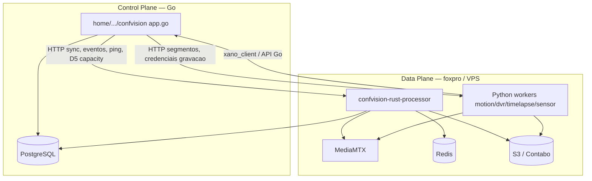

# Estrutura do ecossistema ConfMonit / ConfVision

**Investigação:** 2026-09-30 · somente leitura (sem mover/renomear/apagar/commit).  
**Objetivo:** eliminar confusão entre pastas `confvision`, clones Git e papel do `core4`.

---

## 1. Visão geral — o que é `C:\sistemaconfmonit\core4\`?

| Conceito | Evidência | Conclusão |
|----------|-----------|-----------|
| Nome “core4” = container Proxmox | Contexto operador | **Plausível**; não verificável só por Git |
| Workspace Cursor | Pasta aberta como workspace “core4” | **Sim** |
| Um único sistema | Conteúdo heterogêneo | **Não** |
| Repositório Git | `.git` na raiz | **Sim** → remote `https://github.com/adrianobraz/ConfVision.git` |
| Monorepo | XanoScript + ConfMonit + Python ConfVision + docs | **Sim** (no branch `main` local) |

**Resposta direta:** `core4` é **raiz do workspace Cursor + clone Git do repositório ConfVision (branch `main`) + espelho local do ecossistema ConfMonit** (`home/confmonit/v4.0/`) **+ backend XanoScript** (`apis/`, `tables/`, …). **Não** é o nome de um único aplicativo.

---

## 2. Estrutura de diretórios (relevante)

```text
C:\sistemaconfmonit\
├── core4\                          ← workspace Cursor + Git (ConfVision.git, branch main)
│   ├── apis/, tables/, functions/  ← XanoScript (versionado no mesmo Git)
│   ├── confvision\                 ← Python video/workers (path no branch main)
│   ├── confvision-rust-processor\  ← local: sobretudo artefatos (target/); sem Cargo.toml completo no workspace
│   ├── home\confmonit\v4.0\        ← ecossistema ConfMonit (vários sistemas Go e outros)
│   │   ├── confvision\             ← ConfVision aplicação/API Go (+ UI estática)
│   │   ├── webCentral, webCliente, …
│   │   ├── apifunction, confservice, …
│   │   └── …
│   ├── docs\                       ← documentação global do workspace
│   └── AGENTS.md, CLAUDE.md        ← instruções Xano (Cursor)
│
├── core4-rust-pilot\               ← Git separado, MESMO remote, branch rust-pilot
│   ├── confvision-rust-processor\  ← Rust processor (fonte completa)
│   ├── *.py (raiz)                 ← workers Python (layout branch rust-pilot)
│   ├── home\confmonit\v4.0\confvision\  ← subset Go (21 arquivos versionados)
│   └── deploy\, easypanel\, …
│
├── ConfVision\                     ← Git separado, MESMO remote, branch rust-pilot (commit mais antigo)
│   └── (layout igual rust-pilot; sem pasta home/ no working tree)
│
├── dialyze\                        ← Git: github.com/adrianobraz/dialyze (outro produto)
└── receptor-4\                     ← sem .git neste caminho (pasta local / espelho)
```

Adaptar caminhos ao **branch**: no **`main`** do `core4`, Python vive em `confvision/*.py`. No **`rust-pilot`**, Python vive na **raiz do repositório** (`dvr_main.py`, etc.) — **mesmo GitHub, layouts diferentes entre branches**.

---

## 3. Sistemas do ecossistema (`home/confmonit/v4.0/`)

Presentes no **Git branch `main`** (evidência `git ls-tree main:home/confmonit/v4.0`):

| Sistema | Caminho | Linguagem (típica) | Função (resumida) | Git em `core4` |
|---------|---------|-------------------|-------------------|----------------|
| ConfVision app/API | `…/confvision/` | **Go** (`app.go`, `src/modulos/`) | Portal, API `vis_*`, Postgres, proxy Xano, D5 Rust assign | Sim |
| API genérica | `api/` | Go | API ecossistema | Sim |
| API teste | `apiTeste/` | Go | Testes | Sim |
| ConfService | `confservice/` | Go + web | Serviço conf | Sim |
| Franqueado Pro+ | `franqueadopromais/` | Go | Portal franqueado | Sim |
| Receptor Web | `receptorWeb/` | Go | Receptor | Sim |
| Robot | `robot/` | Go | Automação | Sim |
| Task Xano | `taskxano/` | Go | Integração Xano | Sim |
| Terminal móvel | `terminalMovel/` | Go | App terminal | Sim |
| Web Central / Cliente / … | `webCentral/`, etc. | Go (+ front) | Portais web | Sim |
| FP billing / domínio | `fp-*` | Go | Billing/provision | Sim |
| Deploy | `deploy/` | scripts | Deploy ecossistema | Sim |

No **disco local** podem existir pastas adicionais (ex.: `apifunction/`, `webTecnico/`) **untracked** ou só em outras branches — não assumir produção sem `git ls-files`.

**ConfVision (produto vídeo)** no sentido usuário = principalmente **`home/confmonit/v4.0/confvision`** (Go), **não** todo o `v4.0/`.

---

## 4. ConfVision principal (aplicação / API)

| Item | Valor verificado |
|------|------------------|
| **Caminho** | `C:\sistemaconfmonit\core4\home\confmonit\v4.0\confvision\` |
| **Entrypoint** | `app.go` → HTTP(S), `roteador.ConfigurarRotas()` |
| **Linguagem** | Go 1.25 (`go.mod` module `confvision`) |
| **Backend** | `src/modulos/visdata` (Postgres), `visapi` (dispatch API), `modulos/confvision` (UI/páginas) |
| **Banco** | PostgreSQL (`src/conexao/postgres.go`, pool max 25 conexões) |
| **Bridge legado** | Xano via env (`XANO_BASE_URL`, `vis_or_xano.go`) quando Postgres off |
| **Integração vídeo** | `rust_processor_d5.go` → HTTP GET `/capacity-report` nos processors Rust; sync câmeras / `vis_worker_ping` |
| **Frontend** | Templates/recursos em `recursos/` (HTML/JS) |

**Confirmado:** este é o **ConfVision principal** (cadastro, eventos, gerenciamento, API consumida por workers).

---

## 5. ConfVision video processing (workers + Rust)

### No workspace `core4` (branch `main`)

| Item | Valor |
|------|--------|
| **Caminho Python** | `C:\sistemaconfmonit\core4\confvision\` (**subpasta**, não a mesma que o Go) |
| **Git** | Parte do repo `core4`; paths `confvision/*.py` |
| **Conteúdo** | Workers: `main.py` (analítico legado), `dvr_main.py`, `motion_main.py`, `timelapse_main.py`, `sensor_main.py`, `distributed_main.py`, deploy Docker/EasyPanel, `mediamtx/`, docs migração Rust |
| **Rust no core4** | `confvision-rust-processor/` — **fonte canônica** (Fases 1–6) desde a consolidação (`consolidate/confvision-*`) |

### No clone `core4-rust-pilot` (branch `rust-pilot`)

| Item | Valor |
|------|--------|
| **Python** | Mesmos módulos na **raiz do repositório** (`dvr_main.py`, …) — **outro layout**, mesmo GitHub |
| **Rust** | `confvision-rust-processor/` **completo** (Cargo, `src/main.rs`, fases 1–6 docs) |
| **Go parcial** | `home/confmonit/v4.0/confvision/` — **21 arquivos** (D5, coleta, stream health, etc.), não o app Go inteiro |

**Confirmado:** processamento de vídeo = **Python workers + Rust processor + MediaMTX**, conversando com a **API Go**. No workspace `core4`, o Python está em **`core4\confvision\`**; no clone piloto, na **raiz do repo**.

**Serviços (EasyPanel / nomes operacionais):**

| Serviço | Código | Responsabilidade |
|---------|--------|------------------|
| confvision-worker (Python) | `main.py` / legado | Analítico — **política piloto: Stop** |
| confvision-rust-processor | Rust | Analítico RTSP/YOLO/eventos (piloto) |
| confvision-motion | `motion_main.py` | MOG2 + clips movimento |
| confvision-timelapse | `timelapse_main.py` | Timelapse |
| confvision-sensor | `sensor_main.py` | Poll + capture sensor |
| confvision-dvr | `dvr_main.py` | Gravação contínua MTX → S3 |
| confvision-sync-agent | `sync_agent_main.py` (+ `config_cache.py`) | Cache Redis config — em `core4/confvision/` |
| MediaMTX | `mediamtx/`, Dockerfiles | RTSP/RTMP/record |

---

## 6. Relação entre componentes (confirmada no código)



- **Não** há import Go → pasta `core4/confvision`.
- **Há** referência filesystem em script Go: `core4-rust-pilot/confvision-rust-processor/sql/...` (`fase0-apply-ops`).
- Python usa **`XANO_BASE_URL`** e/ou API Go conforme deploy (`config.py`).

---

## 7. Repositórios Git

| Caminho | Git? | Remote | Branch local | Commit (2026-09-30) | Papel |
|---------|------|--------|--------------|---------------------|--------|
| `C:\sistemaconfmonit\core4` | Sim | `adrianobraz/ConfVision` | `main` (tracks `origin/fix/confvision-rtmp-postgres-nal`) | `bc22286` | Workspace ecossistema + Xano + Go full + Python em `confvision/` |
| `C:\sistemaconfmonit\core4-rust-pilot` | Sim | idem | `rust-pilot` | `a2caf47` (+ WIP uncommitted) | Piloto Rust + Python na raiz + subset Go |
| `C:\sistemaconfmonit\ConfVision` | Sim | idem | `rust-pilot` | `7282bc7` (**atrás** de `origin/rust-pilot`) | Clone alternativo; doc `ARQUITETURA_PROJETOS.md`; **sem** `home/` no disco |
| `core4/confvision/` | Não (subdir) | — | — | — | Pasta dentro do Git `core4` |
| `core4/home/.../confvision/` | Não (subdir) | — | — | — | App Go dentro do Git `core4` |
| `C:\sistemaconfmonit\dialyze` | Sim | `adrianobraz/dialyze` | `main` | — | **Outro produto** |
| `C:\sistemaconfmonit\receptor-4` | **Não** (.git ausente) | — | — | — | Pasta local; origem **não determinada** |

**Histórico:** `main` (`bc22286`) e `rust-pilot` (`a2caf47`) **divergem**; `merge-base` existe mas árvores diferem (Python em `confvision/` vs raiz; Go full vs subset).

---

## 8. Pasta `C:\sistemaconfmonit\ConfVision\`

| Pergunta | Resposta |
|----------|----------|
| Mesmo GitHub? | **Sim** — `origin` = ConfVision.git |
| Mesmo que `core4/confvision`? | **Não** — é **clone de repositório inteiro**, layout branch `rust-pilot` (Python na raiz) |
| Mesmo que Go principal? | **Não** — Go principal está em `core4/home/.../confvision`, **fora** do working tree deste clone |
| Clone / backup / piloto? | **Clone Git alternativo**; branch `rust-pilot`; commit **mais antigo** que `core4-rust-pilot`; documentação interna trata como “repositório oficial Python” |
| Abandonado? | **Não** — working tree com modificações Rust; porém **desatualizado** vs `core4-rust-pilot` |
| Origem criada | **ORIGEM DESCONHECIDA** (data exata); evidência: clone manual típico (`ConfVision` vs `core4-rust-pilot`), mesma URL remota |

**FINALIDADE:** segundo working copy do repo **ConfVision** para deploy/Python/Rust; **não** substitui o workspace `core4` com ecossistema ConfMonit completo.

Documento existente no clone: `ARQUITETURA_PROJETOS.md` (parcialmente **desatualizado** — afirma Go “fora do GitHub”, mas `core4` e `rust-pilot` **versionam** trechos de `home/confmonit/.../confvision`).

---

## 9. Regras para Cursor (não confundir projetos)

1. **`core4`** = workspace do ecossistema; **não** tratar como um único app.
2. **`core4/home/confmonit/v4.0/`** = vários sistemas; ConfMonit **≠** só ConfVision.
3. **`core4/home/confmonit/v4.0/confvision/`** = **ConfVision principal (Go)** — API/portal/Postgres.
4. **`core4/confvision/`** = **processamento vídeo Python** (branch `main`); **≠** pasta Go acima.
5. **`core4-rust-pilot/confvision-rust-processor/`** = **Rust processor** — fonte canônica para Fases 1–6.
6. **`C:\sistemaconfmonit\ConfVision\`** = outro clone do **mesmo GitHub**; layout `rust-pilot`; **não** é o Go app completo.
7. Antes de editar: **`git rev-parse --show-toplevel`** e **`git branch --show-current`**.
8. **Não** assumir que duas pastas chamadas `confvision` são o mesmo diretório ou o mesmo branch layout.
9. **Não** mover/apagar clones duplicados sem auditoria (esta doc).
10. **XanoScript** em `core4/apis`, `tables/` ≠ ConfVision vídeo — mesmo repo Git no `main`, domínios diferentes.

---

## 10. Workspace Cursor (multi-root)

Pastas frequentemente abertas juntas: `core4`, `receptor-4`, `dialyze`. Apenas **`core4`** e clones ConfVision pertencem ao produto ConfVision; **`dialyze`** é repositório separado.

---

## 11. Árvores de Desenvolvimento e Git

Auditoria detalhada: [docs/AUDITORIA_ARVORES_GIT.md](./AUDITORIA_ARVORES_GIT.md).

| Diretório | Tipo | Finalidade | Git | Remote | Branch | Commit (HEAD) | Status | Origem | Pode ser removida? |
|-----------|------|------------|-----|--------|--------|---------------|--------|--------|-------------------|
| `core4` | WORKSPACE + worktree principal | Ecossistema ConfMonit, Xano, Go app, Python vídeo (`main`) | Object store em `core4\.git` | ConfVision.git | `main` | `bc22286` | WIP (~62 status) | Repositório principal | **NÃO** |
| `core4-fase0-push` | WORKTREE | Branch Fase 0 apply-ops / Postgres | Comum `core4\.git` | ConfVision.git | `chore/fase0-apply-ops` | `264c8c2` | Limpo | `git worktree add` ~2026-09-29 | **REVISÃO MANUAL NECESSÁRIA** |
| `core4-push-wt` | WORKTREE | Scripts Fase 0 verify/diagnose | Comum `core4\.git` | ConfVision.git | `confvision/fase0-scripts` | `57e7554` | Limpo | `git worktree add` ~2026-09-28 | **REVISÃO MANUAL NECESSÁRIA** |
| `core4-rust-pilot` | WORKTREE / PILOTO | Rust processor + WIP Fases 1–6 | Comum `core4\.git` | ConfVision.git | `rust-pilot` | `a2caf47` | WIP (~101 status) | Worktree ~2026-09-26 | **NÃO** (WIP exclusivo) |
| `ConfVision` | CLONE | Cópia local antiga layout `rust-pilot` | `.git` próprio | ConfVision.git | `rust-pilot` | `7282bc7` | WIP (~61 status) | Clone ~2026-08-03 | **REVISÃO MANUAL NECESSÁRIA** |

**Contagens (2026-09-30):** 2 object stores Git (`core4\.git`, `ConfVision\.git`); **4 worktrees** no repo `core4`; **1 clone** independente auditado (`ConfVision`).

---

## 12. Fase 7 (consolidação publicada)

- Canônico Rust/Python/Go: **`core4`** — branch **`consolidate/confvision-phase7`**
- Detalhe: [confvision/docs/FASE-7-CONSOLIDACAO.md](../confvision/docs/FASE-7-CONSOLIDACAO.md)

---

## Referências cruzadas

- `docs/AUDITORIA_ARVORES_GIT.md`
- `confvision/docs/AUDITORIA_CONSOLIDACAO_6_FASES.md`
- `confvision/docs/ARCHITECTURE_FINAL.md`
- `ConfVision/ARQUITETURA_PROJETOS.md` (visão clone; validar datas)
- `core4-rust-pilot/confvision-rust-processor/docs/FASE-*.md`
